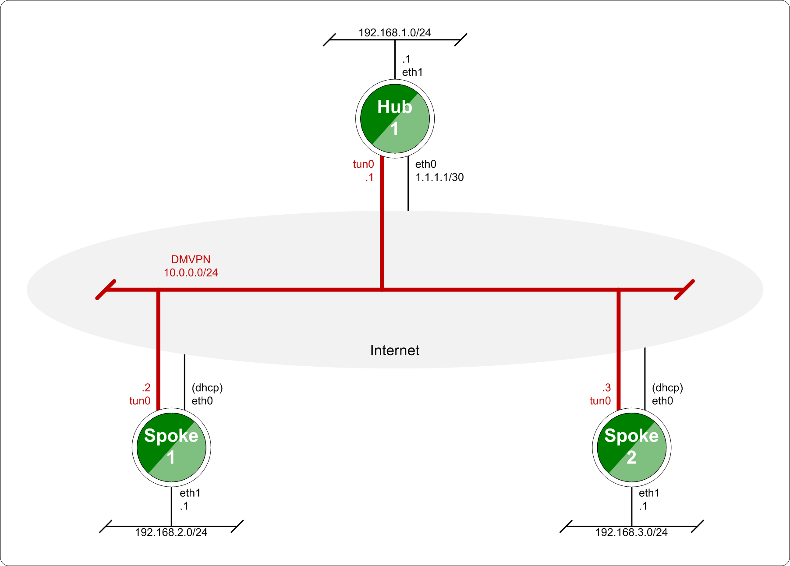

VPN
===

OpenVPN
-------

Traditionally hardware routers implement IPsec exclusively due to relative
ease of implementing it in hardware and insufficient CPU power for doing
encryption in software. Since VyOS is a software router, this is less of a
concern. OpenVPN has been widely used on UNIX platform for a long time and is
a popular option for remote access VPN, though it's also capable of
site-to-site connections.

The advantages of OpenVPN are:
* It uses a single TCP or UDP connection and does not rely on packet source
addresses, so it will work even through a double NAT: perfect for public
hotspots and such

* It's easy to setup and offers very flexible split tunneling

* There's a variety of client GUI frontends for any platform

The disadvantages are:
* It's slower than IPsec due to higher protocol overhead and the fact it runs
in user mode while IPsec, on Linux, is in kernel mode

* None of the operating systems have client software installed by default

In the VyOS CLI, a key point often overlooked is that rather than being
configured using the `set vpn` stanza, OpenVPN is configured as a network
interface using `set interfaces openvpn`.

OpenVPN Site-To-Site
^^^^^^^^^^^^^^^^^^^^

While many are aware of OpenVPN as a Client VPN solution, it is often
overlooked as a site-to-site VPN solution due to lack of support for this mode
in many router platforms.

Site-to-site mode supports x.509 but doesn't require it and can also work with
static keys, which is simpler in many cases. In this example, we'll configure
a simple site-to-site OpenVPN tunnel using a 2048-bit pre-shared key.

First, one one of the systems generate the key using the operational command
`generate openvpn key <filename>`. This will generate a key with the name
provided in the `/config/auth/` directory. Once generated, you will need to
copy this key to the remote router.

In our example, we used the filename `openvpn-1.key` which we will reference
in our configuration.

* The public IP address of the local side of the VPN will be 198.51.100.10
* The remote will be 203.0.113.11
* The tunnel will use 10.255.1.1 for the local IP and 10.255.1.2 for the remote.
* OpenVPN allows for either TCP or UDP. UDP will provide the lowest latency,
  while TCP will work better for lossy connections; generally UDP is preferred
  when possible.
* The official port for OpenVPN is 1194, which we reserve for client VPN; we
  will use 1195 for site-to-site VPN.
* The `persistent-tunnel` directive will allow us to configure tunnel-related
  attributes, such as firewall policy as we would on any normal network
  interface.
* If known, the IP of the remote router can be configured using the
  `remote-host` directive; if unknown, it can be omitted. We will assume a
  dynamic IP for our remote router.

Local Configuration:

.. code-block:: sh

  set interfaces openvpn vtun1 mode site-to-site
  set interfaces openvpn vtun1 protocol udp
  set interfaces openvpn vtun1 persistent-tunnel
  set interfaces openvpn vtun1 local-host '198.51.100.10'
  set interfaces openvpn vtun1 local-port '1195'
  set interfaces openvpn vtun1 remote-port '1195'
  set interfaces openvpn vtun1 shared-secret-key-file '/config/auth/openvpn-1.key'
  set interfaces openvpn vtun1 local-address '10.255.1.1'
  set interfaces openvpn vtun1 remote-address '10.255.1.2'

Remote Configuration:

.. code-block:: sh

  set interfaces openvpn vtun1 mode site-to-site
  set interfaces openvpn vtun1 protocol udp
  set interfaces openvpn vtun1 persistent-tunnel
  set interfaces openvpn vtun1 remote-host '198.51.100.10'
  set interfaces openvpn vtun1 local-port '1195'
  set interfaces openvpn vtun1 remote-port '1195'
  set interfaces openvpn vtun1 shared-secret-key-file '/config/auth/openvpn-1.key'
  set interfaces openvpn vtun1 local-address '10.255.1.2'
  set interfaces openvpn vtun1 remote-address '10.255.1.1'

The configurations above will default to using 128-bit Blowfish in CBC mode
for encryption and SHA-1 for HMAC authentication. These are both considered
weak, but a number of other encryption and hashing algorithms are available:

For Encryption:

.. code-block:: sh

  vyos@vyos# set interfaces openvpn vtun1 encryption
  Possible completions:
    des          DES algorithm
    3des         DES algorithm with triple encryption
    bf128        Blowfish algorithm with 128-bit key
    bf256        Blowfish algorithm with 256-bit key
    aes128       AES algorithm with 128-bit key
    aes192       AES algorithm with 192-bit key
    aes256       AES algorithm with 256-bit key

For Hashing:

.. code-block:: sh

  vyos@vyos# set interfaces openvpn vtun1 hash
  Possible completions:
    md5          MD5 algorithm
    sha1         SHA-1 algorithm
    sha256       SHA-256 algorithm
    sha512       SHA-512 algorithm

If you change the default encryption and hashing algorithms, be sure that the
local and remote ends have matching configurations, otherwise the tunnel will
not come up.

Static routes can be configured referencing the tunnel interface; for example,
the local router will use a network of 10.0.0.0/16, while the remote has a
network of 10.1.0.0/16:

Local Configuration:

.. code-block:: sh

  set protocols static interface-route 10.1.0.0/16 next-hop-interface vtun1

Remote Configuration:

.. code-block:: sh

  set protocols static interface-route 10.0.0.0/16 next-hop-interface vtun1

Firewall policy can also be applied to the tunnel interface for `local`, `in`,
and `out` directions and function identically to ethernet interfaces.

If making use of multiple tunnels, OpenVPN must have a way to distinguish
between different tunnels aside from the pre-shared-key. This is either by
referencing IP address or port number. One option is to dedicate a public IP
to each tunnel. Another option is to dedicate a port number to each tunnel
(e.g. 1195,1196,1197...).

OpenVPN status can be verified using the `show openvpn` operational commands.
See the built-in help for a complete list of options.

OpenVPN Server
^^^^^^^^^^^^^^

Multi-client server is the most popular OpenVPN mode on routers. It always uses
x.509 authentication and therefore requires a PKI setup. This guide assumes you
have already setup a PKI and have a CA certificate, a server certificate and
key, a certificate revokation list, a Diffie-Hellman key exchange parameters
file. You do not need client certificates and keys for the server setup.

In this example we will use the most complicated case: a setup where each
client is a router that has its own subnet (think HQ and branch offices), since
simpler setups are subsets of it.

Suppose you want to use 10.23.1.0/24 network for client tunnel endpoints and
all client subnets belong to 10.23.0.0/20. All clients need access to the
192.168.0.0/16 network.

First we need to specify the basic settings. 1194/UDP is the default. The
`persistent-tunnel` option is recommended, it prevents the TUN/TAP device from
closing on connection resets or daemon reloads.

.. code-block:: sh

  set interfaces openvpn vtun10 mode server
  set interfaces openvpn vtun10 local-port 1194
  set interfaces openvpn vtun10 persistent-tunnel
  set interfaces openvpn vtun10 protocol udp

Then we need to specify the location of the cryptographic materials. Suppose
you keep the files in `/config/auth/openvpn`

.. code-block:: sh

  set interfaces openvpn vtun10 tls ca-cert-file /config/auth/openvpn/ca.crt
  set interfaces openvpn vtun10 tls cert-file /config/auth/openvpn/server.crt
  set interfaces openvpn vtun10 tls key-file /config/auth/openvpn/server.key
  set interfaces openvpn vtun10 tls crl-file /config/auth/openvpn/crl.pem
  set interfaces openvpn vtun10 tls dh-file /config/auth/openvpn/dh2048.pem

Now we need to specify the server network settings. In all cases we need to
specify the subnet for client tunnel endpoints. Since we want clients to access
a specific network behind out router, we will use a push-route option for
installing that route on clients.

.. code-block:: sh

  set interfaces openvpn vtun10 server push-route 192.168.0.0/16
  set interfaces openvpn vtun10 server subnet 10.23.1.0/24

Since it's a HQ and branch offices setup, we will want all clients to have
fixed addresses and we will route traffic to specific subnets through them. We
need configuration for each client to achieve this.

.. note:: Clients are identified by the CN field of their x.509 certificates,
   in this example the CN is ``client0``:

.. code-block:: sh

  set interfaces openvpn vtun10 server client client0 ip 10.23.1.10
  set interfaces openvpn vtun10 server client client0 subnet 10.23.2.0/25

OpenVPN **will not** automatically create routes in the kernel for client
subnets when they connect and will only use client-subnet association
internally, so we need to create a route to the 10.23.0.0/20 network ourselves:

.. code-block:: sh

  set protocols static interface-route 10.23.0.0/20 next-hop-interface vtun10

L2TP over IPsec
---------------

Example for configuring a simple L2TP over IPsec VPN for remote access (works
with native Windows and Mac VPN clients):

.. code-block:: sh

  set vpn ipsec ipsec-interfaces interface eth0
  set vpn ipsec nat-traversal enable
  set vpn ipsec nat-networks allowed-network 0.0.0.0/0

  set vpn l2tp remote-access outside-address 203.0.113.2
  set vpn l2tp remote-access client-ip-pool start 192.168.255.1
  set vpn l2tp remote-access client-ip-pool stop 192.168.255.254
  set vpn l2tp remote-access ipsec-settings authentication mode pre-shared-secret
  set vpn l2tp remote-access ipsec-settings authentication pre-shared-secret <secret>
  set vpn l2tp remote-access authentication mode local
  set vpn l2tp remote-access authentication local-users username <username> password <password>

In the example above an external IP of 203.0.113.2 is assumed.

If a local firewall policy is in place on your external interface you will need
to open:

* UDP port 500 (IKE)
* IP protocol number 50 (ESP)
* UDP port 1701 for IPsec

In addition when NAT is detected by the VPN client ESP is encapsulated in UDP
for NAT-traversal:

* UDP port 4500 (NAT-T)

Example:

.. code-block:: sh

  set firewall name OUTSIDE-LOCAL rule 40 action 'accept'
  set firewall name OUTSIDE-LOCAL rule 40 destination port '50'
  set firewall name OUTSIDE-LOCAL rule 40 protocol 'esp'
  set firewall name OUTSIDE-LOCAL rule 41 action 'accept'
  set firewall name OUTSIDE-LOCAL rule 41 destination port '500'
  set firewall name OUTSIDE-LOCAL rule 41 protocol 'udp'
  set firewall name OUTSIDE-LOCAL rule 42 action 'accept'
  set firewall name OUTSIDE-LOCAL rule 42 destination port '4500'
  set firewall name OUTSIDE-LOCAL rule 42 protocol 'udp'
  set firewall name OUTSIDE-LOCAL rule 43 action 'accept'
  set firewall name OUTSIDE-LOCAL rule 43 destination port '1701'
  set firewall name OUTSIDE-LOCAL rule 43 ipsec 'match-ipsec'
  set firewall name OUTSIDE-LOCAL rule 43 protocol 'udp'

Also note that if you wish to allow the VPN to be used for external access you
will need to add the appropriate source NAT rules to your configuration.

.. code-block:: sh

  set nat source rule 110 outbound-interface 'eth0'
  set nat source rule 110 source address '192.168.255.0/24'
  set nat source rule 110 translation address masquerade

To be able to resolve when connected to the VPN, the following DNS rules are
needed as well.

.. code-block:: sh

  set vpn l2tp remote-access dns-servers server-1 '8.8.8.8'
  set vpn l2tp remote-access dns-servers server-2 '8.8.4.4'

.. note:: Those are the `Google public DNS`_ servers. You can also use the
   public available servers from Quad9_ (9.9.9.9) or Cloudflare_ (1.1.1.1).

Established sessions can be viewed using the **show vpn remote-access**
operational command.

.. code-block:: sh

  vyos@vyos:~$ show vpn remote-access
  Active remote access VPN sessions:
  User            Proto Iface     Tunnel IP       TX byte RX byte  Time
  ----            ----- -----     ---------       ------- -------  ----
  vyos            L2TP  l2tp0     192.168.255.1      3.2K    8.0K  00h06m13s

RADIUS authentication
^^^^^^^^^^^^^^^^^^^^^

The above configuration made use of local accounts on the VyOS router for
authenticating L2TP/IPSec clients. In bigger environments usually something
like RADIUS_ (FreeRADIUS_ or Microsoft `Network Policy Server`_, NPS) is used.

VyOS supports either `local` or `radius` user authentication:

.. code-block:: sh

  set vpn l2tp remote-access authentication mode <local|radius>

In addition one or more RADIUS_ servers can be configured to server for user
authentication. This is done using the `radius-server` and `key` nodes:

.. code-block:: sh

  set vpn l2tp remote-access authentication radius-server 1.1.1.1 key 'foo'
  set vpn l2tp remote-access authentication radius-server 2.2.2.2 key 'foo'

.. note:: Some RADIUS_ severs make use of an access control list who is allowed
   to query the server. Please configure your VyOS router in the allowed client
   list.

RADIUS source address
*********************

Yet there is no way to configure the used RADIUS_ client source IP address on
the VyOS router, this is work in progres, see https://phabricator.vyos.net/T828.

The IP address nearest to the radius server is currently used. If in doubt,
configure all IP addresses from the VyOS router in question.

Site-to-Site IPsec
------------------

Example:
* eth1 is WAN interface
* left subnet: 192.168.0.0/24 #s ite1, server side (i.e. locality, actually
there is no client or server roles)
* left local_ip: 1.1.1.1 # server side WAN IP
* right subnet: 10.0.0.0/24  # site2,remote office side
* right local_ip: 2.2.2.2 # remote office side WAN IP

.. code-block:: sh

  # server config
  set vpn ipsec esp-group office-srv-esp compression 'disable'
  set vpn ipsec esp-group office-srv-esp lifetime '1800'
  set vpn ipsec esp-group office-srv-esp mode 'tunnel'
  set vpn ipsec esp-group office-srv-esp pfs 'enable'
  set vpn ipsec esp-group office-srv-esp proposal 1 encryption 'aes256'
  set vpn ipsec esp-group office-srv-esp proposal 1 hash 'sha1'
  set vpn ipsec ike-group office-srv-ike ikev2-reauth 'no'
  set vpn ipsec ike-group office-srv-ike key-exchange 'ikev1'
  set vpn ipsec ike-group office-srv-ike lifetime '3600'
  set vpn ipsec ike-group office-srv-ike proposal 1 encryption 'aes256'
  set vpn ipsec ike-group office-srv-ike proposal 1 hash 'sha1'
  set vpn ipsec ipsec-interfaces interface 'eth1'
  set vpn ipsec site-to-site peer 2.2.2.2 authentication mode 'pre-shared-secret'
  set vpn ipsec site-to-site peer 2.2.2.2 authentication pre-shared-secret 'SomePreSharedKey'
  set vpn ipsec site-to-site peer 2.2.2.2 ike-group 'office-srv-ike'
  set vpn ipsec site-to-site peer 2.2.2.2 local-address '1.1.1.1'
  set vpn ipsec site-to-site peer 2.2.2.2 tunnel 0 allow-nat-networks 'disable'
  set vpn ipsec site-to-site peer 2.2.2.2 tunnel 0 allow-public-networks 'disable'
  set vpn ipsec site-to-site peer 2.2.2.2 tunnel 0 esp-group 'office-srv-esp'
  set vpn ipsec site-to-site peer 2.2.2.2 tunnel 0 local prefix '192.168.0.0/24'
  set vpn ipsec site-to-site peer 2.2.2.2 tunnel 0 remote prefix '10.0.0.0/21'

  # remote office config
  set vpn ipsec esp-group office-srv-esp compression 'disable'
  set vpn ipsec esp-group office-srv-esp lifetime '1800'
  set vpn ipsec esp-group office-srv-esp mode 'tunnel'
  set vpn ipsec esp-group office-srv-esp pfs 'enable'
  set vpn ipsec esp-group office-srv-esp proposal 1 encryption 'aes256'
  set vpn ipsec esp-group office-srv-esp proposal 1 hash 'sha1'
  set vpn ipsec ike-group office-srv-ike ikev2-reauth 'no'
  set vpn ipsec ike-group office-srv-ike key-exchange 'ikev1'
  set vpn ipsec ike-group office-srv-ike lifetime '3600'
  set vpn ipsec ike-group office-srv-ike proposal 1 encryption 'aes256'
  set vpn ipsec ike-group office-srv-ike proposal 1 hash 'sha1'
  set vpn ipsec ipsec-interfaces interface 'eth1'
  set vpn ipsec site-to-site peer 1.1.1.1 authentication mode 'pre-shared-secret'
  set vpn ipsec site-to-site peer 1.1.1.1 authentication pre-shared-secret 'SomePreSharedKey'
  set vpn ipsec site-to-site peer 1.1.1.1 ike-group 'office-srv-ike'
  set vpn ipsec site-to-site peer 1.1.1.1 local-address '2.2.2.2'
  set vpn ipsec site-to-site peer 1.1.1.1 tunnel 0 allow-nat-networks 'disable'
  set vpn ipsec site-to-site peer 1.1.1.1 tunnel 0 allow-public-networks 'disable'
  set vpn ipsec site-to-site peer 1.1.1.1 tunnel 0 esp-group 'office-srv-esp'
  set vpn ipsec site-to-site peer 1.1.1.1 tunnel 0 local prefix '10.0.0.0/21'
  set vpn ipsec site-to-site peer 1.1.1.1 tunnel 0 remote prefix '192.168.0.0/24'

Show status of new setup:

.. code-block:: sh

  vyos@srv-gw0:~$ show vpn ike sa
  Peer ID / IP                            Local ID / IP
  ------------                            -------------
  2.2.2.2                                 1.1.1.1
     State  Encrypt  Hash    D-H Grp  NAT-T  A-Time  L-Time
     -----  -------  ----    -------  -----  ------  ------
     up     aes256   sha1    5        no     734     3600

  vyos@srv-gw0:~$ show vpn ipsec sa
  Peer ID / IP                            Local ID / IP
  ------------                            -------------
  2.2.2.2                                 1.1.1.1
     Tunnel  State  Bytes Out/In   Encrypt  Hash    NAT-T  A-Time  L-Time  Proto
     ------  -----  -------------  -------  ----    -----  ------  ------  -----
     0       up     7.5M/230.6K    aes256   sha1    no     567     1800    all

If there is SNAT rules on eth1, need to add exclude rule

.. code-block:: sh

  # server side
  set nat source rule 10 destination address '10.0.0.0/24'
  set nat source rule 10 'exclude'
  set nat source rule 10 outbound-interface 'eth1'
  set nat source rule 10 source address '192.168.0.0/24'

  # remote office side
  set nat source rule 10 destination address '192.168.0.0/24'
  set nat source rule 10 'exclude'
  set nat source rule 10 outbound-interface 'eth1'
  set nat source rule 10 source address '10.0.0.0/24'

To allow traffic to pass through to clients, you need to add the following
rules. (if you used the default configuration at the top of this page)

.. code-block:: sh

  # server side
  set firewall name OUTSIDE-LOCAL rule 32 action 'accept'
  set firewall name OUTSIDE-LOCAL rule 32 source address '10.0.0.0/24'

  # remote office side
  set firewall name OUTSIDE-LOCAL rule 32 action 'accept'
  set firewall name OUTSIDE-LOCAL rule 32 source address '192.168.0.0/24'

DMVPN
-----

**D** ynamic **M** ultipoint **V** irtual **P** rivate **N** etworking

DMVPN is a dynamic VPN technology originally developed by Cisco. While their
implementation was somewhat proprietary, the underlying technologies are
actually standards based. The three technologies are:

* **NHRP** - NBMA Next Hop Resolution Protocol RFC2332_
* **mGRE** - Multipoint Generic Routing Encapsulation / mGRE RFC1702_
* **IPSec** - IP Security (too many RFCs to list, but start with RFC4301_)

NHRP provides the dynamic tunnel endpoint discovery mechanism (endpoint
registration, and endpoint discovery/lookup), mGRE provides the tunnel
encapsulation itself, and the IPSec protocols handle the key exchange, and
crypto mechanism.

In short, DMVPN provides the capability for creating a dynamic-mesh VPN
network without having to pre-configure (static) all possible tunnel end-point
peers.

.. note:: DMVPN only automates the tunnel endpoint discovery and setup. A
   complete solution also incorporates the use of a routing protocol. BGP is
   particularly well suited for use with DMVPN.

Baseline Configuration:

**STEPS:**

#. Create tunnel config (`interfaces tunnel`)
#. Create nhrp (`protocols nhrp`)
#. Create ipsec vpn (optional, but recommended for security) (`vpn ipsec`)

The tunnel will be set to mGRE if for encapsulation `gre` is set, and no
`remote-ip` is set. If the public ip is provided by DHCP the tunnel `local-ip`
can be set to "0.0.0.0"

   Baseline DMVPN topology

HUB Configuration
^^^^^^^^^^^^^^^^^

.. code-block:: sh

  interfaces
      tunnel <tunN> {
          address <ipv4>
          encapsulation gre
          local-ip <public ip>
          multicast enable
          description <txt>
          parameters {
              ip {
                  <usual IP options>
              }
          }
      }
  }
  protocols {
      nhrp {
          tunnel <tunN> {
              cisco-authentication <key phrase>
              holding-time <seconds>
              multicast dynamic
              redirect
          }
      }
  }
  vpn {
      ipsec {
          esp-group <text> {
              lifetime <30-86400>
              mode tunnel
              pfs enable
              proposal <1-65535> {
                  encryption aes256
                  hash sha1
              }
              proposal <1-65535> {
                  encryption 3des
                  hash md5
              }
          }
          ike-group <text> {
              key-exchange ikev1
              lifetime <30-86400>
              proposal <1-65535> {
                  encryption aes256
                  hash sha1
              }
              proposal <1-65535> {
                  encryption aes128
                  hash sha1
              }
          }
          ipsec-interfaces {
              interface <ethN>
          }
          profile <text> {
              authentication {
                  mode pre-shared-secret
                  pre-shared-secret <key phrase>
              }
              bind {
                  tunnel <tunN>
              }
              esp-group <text>
              ike-group <text>
          }
      }
  }

HUB Example Configuration:

.. code-block:: sh

  set interfaces ethernet eth0 address '1.1.1.1/30'
  set interfaces ethernet eth1 address '192.168.1.1/24'
  set system host-name 'HUB'

  set interfaces tunnel tun0 address 10.0.0.1/24
  set interfaces tunnel tun0 encapsulation gre
  set interfaces tunnel tun0 local-ip 1.1.1.1
  set interfaces tunnel tun0 multicast enable
  set interfaces tunnel tun0 parameters ip key 1

  set protocols nhrp tunnel tun0 cisco-authentication SECRET
  set protocols nhrp tunnel tun0 holding-time  300
  set protocols nhrp tunnel tun0 multicast dynamic
  set protocols nhrp tunnel tun0 redirect

  set vpn ipsec ipsec-interfaces interface eth0
  set vpn ipsec ike-group IKE-HUB proposal 1
  set vpn ipsec ike-group IKE-HUB proposal 1 encryption aes256
  set vpn ipsec ike-group IKE-HUB proposal 1 hash sha1
  set vpn ipsec ike-group IKE-HUB proposal 2 encryption aes128
  set vpn ipsec ike-group IKE-HUB proposal 2 hash sha1
  set vpn ipsec ike-group IKE-HUB lifetime 3600
  set vpn ipsec esp-group ESP-HUB proposal 1 encryption aes256
  set vpn ipsec esp-group ESP-HUB proposal 1 hash sha1
  set vpn ipsec esp-group ESP-HUB proposal 2 encryption 3des
  set vpn ipsec esp-group ESP-HUB proposal 2 hash md5
  set vpn ipsec esp-group ESP-HUB lifetime 1800
  set vpn ipsec esp-group ESP-HUB pfs dh-group2

  set vpn ipsec profile NHRPVPN
  set vpn ipsec profile NHRPVPN authentication mode pre-shared-secret
  set vpn ipsec profile NHRPVPN authentication pre-shared-secret SECRET
  set vpn ipsec profile NHRPVPN bind tunnel tun0
  set vpn ipsec profile NHRPVPN esp-group ESP-HUB
  set vpn ipsec profile NHRPVPN ike-group IKE-HUB

  set protocols static route 0.0.0.0/0 next-hop 1.1.1.2
  set protocols static route 192.168.2.0/24 next-hop 10.0.0.2
  set protocols static route 192.168.3.0/24 next-hop 10.0.0.3

SPOKE Configuration
^^^^^^^^^^^^^^^^^^^

SPOKE1 Configuration:

.. code-block:: sh

  interfaces
      tunnel <tunN> {
          address <ipv4>
          encapsulation gre
          local-ip <public ip>
          multicast enable
          description <txt>
          parameters {
              ip {
                  <usual IP options>
              }
          }
      }
  }
  protocols {
      nhrp {
          tunnel <tunN> {
              cisco-authentication <key phrase>
              map <ipv4/net> {
                  nbma-address <ipv4>
                  register
              }
              holding-time <seconds>
              multicast nhs
              redirect
              shortcut
          }
      }
  }
  vpn {
      ipsec {
          esp-group <text> {
              lifetime <30-86400>
              mode tunnel
              pfs enable
              proposal <1-65535> {
                  encryption aes256
                  hash sha1
              }
              proposal <1-65535> {
                  encryption 3des
                  hash md5
              }
          }
          ike-group <text> {
              key-exchange ikev1
              lifetime <30-86400>
              proposal <1-65535> {
                  encryption aes256
                  hash sha1
              }
              proposal <1-65535> {
                  encryption aes128
                  hash sha1
              }
          }
          ipsec-interfaces {
              interface <ethN>
          }
          profile <text> {
              authentication {
                  mode pre-shared-secret
                  pre-shared-secret <key phrase>
              }
              bind {
                  tunnel <tunN>
              }
              esp-group <text>
              ike-group <text>
          }
      }
  }

SPOKE1 Example Configuration

.. code-block:: sh

  set interfaces ethernet eth0 address 'dhcp'
  set interfaces ethernet eth1 address '192.168.2.1/24'
  set system host-name 'SPOKE1'

  set interfaces tunnel tun0 address 10.0.0.2/24
  set interfaces tunnel tun0 encapsulation gre
  set interfaces tunnel tun0 local-ip 0.0.0.0
  set interfaces tunnel tun0 multicast enable
  set interfaces tunnel tun0 parameters ip key 1

  set protocols nhrp tunnel tun0 cisco-authentication 'SECRET'
  set protocols nhrp tunnel tun0 map 10.0.0.1/24 nbma-address 1.1.1.1
  set protocols nhrp tunnel tun0 map 10.0.0.1/24 'register'
  set protocols nhrp tunnel tun0 multicast 'nhs'
  set protocols nhrp tunnel tun0 'redirect'
  set protocols nhrp tunnel tun0 'shortcut'

  set vpn ipsec ipsec-interfaces interface eth0
  set vpn ipsec ike-group IKE-SPOKE proposal 1
  set vpn ipsec ike-group IKE-SPOKE proposal 1 encryption aes256
  set vpn ipsec ike-group IKE-SPOKE proposal 1 hash sha1
  set vpn ipsec ike-group IKE-SPOKE proposal 2 encryption aes128
  set vpn ipsec ike-group IKE-SPOKE proposal 2 hash sha1
  set vpn ipsec ike-group IKE-SPOKE lifetime 3600
  set vpn ipsec esp-group ESP-SPOKE proposal 1 encryption aes256
  set vpn ipsec esp-group ESP-SPOKE proposal 1 hash sha1
  set vpn ipsec esp-group ESP-SPOKE proposal 2 encryption 3des
  set vpn ipsec esp-group ESP-SPOKE proposal 2 hash md5
  set vpn ipsec esp-group ESP-SPOKE lifetime 1800
  set vpn ipsec esp-group ESP-SPOKE pfs dh-group2

  set vpn ipsec profile NHRPVPN
  set vpn ipsec profile NHRPVPN authentication mode pre-shared-secret
  set vpn ipsec profile NHRPVPN authentication pre-shared-secret SECRET
  set vpn ipsec profile NHRPVPN bind tunnel tun0
  set vpn ipsec profile NHRPVPN esp-group ESP-SPOKE
  set vpn ipsec profile NHRPVPN ike-group IKE-SPOKE

  set protocols static route 192.168.1.0/24 next-hop 10.0.0.1
  set protocols static route 192.168.3.0/24 next-hop 10.0.0.3

SPOKE2 Configuration

.. code-block:: sh

  interfaces
      tunnel <tunN> {
          address <ipv4>
          encapsulation gre
          local-ip <public ip>
          multicast enable
          description <txt>
          parameters {
              ip {
                  <usual IP options>
              }
          }
      }
  }
  protocols {
      nhrp {
          tunnel <tunN> {
              cisco-authentication <key phrase>
              map <ipv4/net> {
                  nbma-address <ipv4>
                  register
              }
              holding-time <seconds>
              multicast nhs
              redirect
              shortcut
          }
      }
  }
  vpn {
      ipsec {
          esp-group <text> {
              lifetime <30-86400>
              mode tunnel
              pfs enable
              proposal <1-65535> {
                  encryption aes256
                  hash sha1
              }
              proposal <1-65535> {
                  encryption 3des
                  hash md5
              }
          }
          ike-group <text> {
              key-exchange ikev1
              lifetime <30-86400>
              proposal <1-65535> {
                  encryption aes256
                  hash sha1
              }
              proposal <1-65535> {
                  encryption aes128
                  hash sha1
              }
          }
          ipsec-interfaces {
              interface <ethN>
          }
          profile <text> {
              authentication {
                  mode pre-shared-secret
                  pre-shared-secret <key phrase>
              }
              bind {
                  tunnel <tunN>
              }
              esp-group <text>
              ike-group <text>
          }
      }
  }

SPOKE2 Example Configuration

.. code-block:: sh

  set interfaces ethernet eth0 address 'dhcp'
  set interfaces ethernet eth1 address '192.168.3.1/24'
  set system host-name 'SPOKE2'

  set interfaces tunnel tun0 address 10.0.0.3/24
  set interfaces tunnel tun0 encapsulation gre
  set interfaces tunnel tun0 local-ip 0.0.0.0
  set interfaces tunnel tun0 multicast enable
  set interfaces tunnel tun0 parameters ip key 1

  set protocols nhrp tunnel tun0 cisco-authentication SECRET
  set protocols nhrp tunnel tun0 map 10.0.0.1/24 nbma-address 1.1.1.1
  set protocols nhrp tunnel tun0 map 10.0.0.1/24 register
  set protocols nhrp tunnel tun0 multicast nhs
  set protocols nhrp tunnel tun0 redirect
  set protocols nhrp tunnel tun0 shortcut

  set vpn ipsec ipsec-interfaces interface eth0
  set vpn ipsec ike-group IKE-SPOKE proposal 1
  set vpn ipsec ike-group IKE-SPOKE proposal 1 encryption aes256
  set vpn ipsec ike-group IKE-SPOKE proposal 1 hash sha1
  set vpn ipsec ike-group IKE-SPOKE proposal 2 encryption aes128
  set vpn ipsec ike-group IKE-SPOKE proposal 2 hash sha1
  set vpn ipsec ike-group IKE-SPOKE lifetime 3600
  set vpn ipsec esp-group ESP-SPOKE proposal 1 encryption aes256
  set vpn ipsec esp-group ESP-SPOKE proposal 1 hash sha1
  set vpn ipsec esp-group ESP-SPOKE proposal 2 encryption 3des
  set vpn ipsec esp-group ESP-SPOKE proposal 2 hash md5
  set vpn ipsec esp-group ESP-SPOKE lifetime 1800
  set vpn ipsec esp-group ESP-SPOKE pfs dh-group2

  set vpn ipsec profile NHRPVPN
  set vpn ipsec profile NHRPVPN authentication mode pre-shared-secret
  set vpn ipsec profile NHRPVPN authentication pre-shared-secret SECRET
  set vpn ipsec profile NHRPVPN bind tunnel tun0
  set vpn ipsec profile NHRPVPN esp-group ESP-SPOKE
  set vpn ipsec profile NHRPVPN ike-group IKE-SPOKE

  set protocols static route 192.168.1.0/24 next-hop 10.0.0.1
  set protocols static route 192.168.2.0/24 next-hop 10.0.0.2

.. _`Google Public DNS`: https://developers.google.com/speed/public-dns
.. _Quad9: https://quad9.net
.. _CloudFlare: https://blog.cloudflare.com/announcing-1111
.. _RADIUS: https://en.wikipedia.org/wiki/RADIUS
.. _FreeRADIUS: https://freeradius.org
.. _`Network Policy Server`: https://en.wikipedia.org/wiki/Network_Policy_Server
.. _RFC2332: https://tools.ietf.org/html/rfc2332
.. _RFC1702: https://tools.ietf.org/html/rfc1702
.. _RFC4301: https://tools.ietf.org/html/rfc4301
