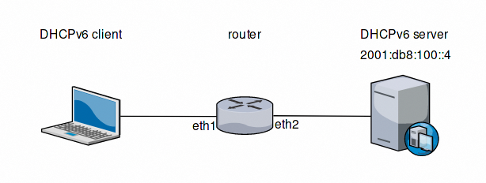

Services
========

DHCP
----

Multiple DHCP Servers can be run from a single machine. Each DHCP service is
identified by a `shared-network-name`.

DHCP Server Example
^^^^^^^^^^^^^^^^^^^

In this example, we are offering address space in the 172.16.17.0/24 network,
which is on eth1, and pppoe0 is our connection to the internet. We are using
the network name `dhcpexample`.

Prerequisites
^^^^^^^^^^^^^

Configuring the PPPoE interface is assumed to be done already, and appears
on `pppoe0`

Interface Configuration
^^^^^^^^^^^^^^^^^^^^^^^

.. code-block:: sh

 set interface eth1 address 172.16.17.1/24

Multiple ranges can be defined and can contain holes.

.. code-block:: sh

  set service dhcp-server shared-network-name dhcpexample authoritative
  set service dhcp-server shared-network-name dhcpexample subnet 172.16.17.0/24 default-router 172.16.17.1
  set service dhcp-server shared-network-name dhcpexample subnet 172.16.17.0/24 dns-server 172.16.17.1
  set service dhcp-server shared-network-name dhcpexample subnet 172.16.17.0/24 lease 86400
  set service dhcp-server shared-network-name dhcpexample subnet 172.16.17.0/24 range 0 start 172.16.17.100
  set service dhcp-server shared-network-name dhcpexample subnet 172.16.17.0/24 range 0 stop 172.16.17.199

Failover
^^^^^^^^

VyOS provides support for DHCP failover:

.. code-block:: sh

  set service dhcp-server shared-network-name 'LAN' subnet '192.168.0.0/24' failover local-address '192.168.0.1'
  set service dhcp-server shared-network-name 'LAN' subnet '192.168.0.0/24' failover name 'foo'
  set service dhcp-server shared-network-name 'LAN' subnet '192.168.0.0/24' failover peer-address '192.168.0.2'

**NOTE:** `name` must be identical on both sides!

The primary and secondary statements determines whether the server is primary or secondary

.. code-block:: sh

  set service dhcp-server shared-network-name 'LAN' subnet '192.168.0.0/24' failover status 'primary'

or

.. code-block:: sh

  set service dhcp-server shared-network-name 'LAN' subnet '192.168.0.0/24' failover status 'secondary'

**NOTE:** In order for the primary and the secondary DHCP server to keep their
lease tables in sync, they must be able to reach each other on TCP port 647.
If you have firewall rules in effect, adjust them accordingly.

Static mappings MAC/IP
^^^^^^^^^^^^^^^^^^^^^^

.. code-block:: sh

  set service dhcp‐server shared‐network‐name dhcpexample subnet 172.16.17.0/24 static‐mapping static-mapping-01 ip‐address 172.16.17.10
  set service dhcp‐server shared‐network‐name dhcpexample subnet 172.16.17.0/24 static‐mapping static-mapping-01 mac‐address ff:ff:ff:ff:ff:ff

Explanation
^^^^^^^^^^^

:code:`set service dhcp-server shared-network-name dhcpexample authoritative`
This says that this device is the only DHCP server for this network. If other
devices are trying to offer DHCP leases, this machine will send 'DHCPNAK' to
any device trying to request an IP address that is not valid for this network.

:code:`set service dhcp-server shared-network-name dhcpexample subnet
172.16.17.0/24 default-router 172.16.17.1` This is a configuration parameter
for the subnet, saying that as part of the response, tell the client that I am
the default router for this network

:code:`set service dhcp-server shared-network-name dhcpexample subnet
172.16.17.0/24 dns-server 172.16.17.1` This is a configuration parameter for
the subnet, saying that as part of the response, tell the client that I am the
DNS server for this network. If you do not want to run a DNS server, you could
also provide one of the public DNS servers, such as google's. You can add
multiple entries by repeating the line.

:code:`set service dhcp-server shared-network-name dhcpexample subnet
172.16.17.0/24 lease 86400` Assign the IP address to this machine for 24
hours. It is unlikely you'd need to shorten this period, unless you are running
a network with lots of devices appearing and disappearing.

:code:`set service dhcp-server shared-network-name dhcpexample subnet
172.16.17.0/24 start 172.16.17.100 stop 172.16.17.199` Make the IP Addresses
between .100 and .199 available for clients.

DHCPv6 server
-------------

VyOS provides DHCPv6 server functionality which is described in this section.
In order to use the DHCPv6 server it has to be enabled first:

.. code-block:: sh

  set service dhcpv6-server

To restart the DHCPv6 server (operational mode):

.. code-block:: sh

  restart dhcpv6 server

To show the current status of the DHCPv6 server use:

.. code-block:: sh

  show dhcpv6 server status

Show statuses of all assigned leases:

.. code-block:: sh

  show dhcpv6 server leases

DHCPv6 server options
^^^^^^^^^^^^^^^^^^^^^

DHCPv6 server preference value
******************************

Clients receiving advertise messages from multiple servers choose the server
with the highest preference value. The range for this value is `0...255`. Set
a preference value for the DHCPv6 server:

.. code-block:: sh

  set service dhcpv6-server preference <preference value>

Delete a preference:

.. code-block:: sh

  set service dhcpv6-server preference

Show current preference:

.. code-block:: sh

  show service dhcpv6-server preference

Specify address lease time
**************************

The default lease time for DHCPv6 leases is 24 hours. This can be changed by
supplying a `default-time`, `maximum-time` and `minimum-time` (all values in
seconds):

.. code-block:: sh

  set service dhcpv6-server shared-network-name <name> subnet <ipv6net> lease-time {default <default-time> | maximum <maximum-time> | minimum <minimum-time>}

Reset the custom lease times:

.. code-block:: sh

  delete service dhcpv6-server shared-network-name <name> subnet <ipv6net> lease-time {default | maximum | minimum}

Show the current configuration:

.. code-block:: sh

  show service dhcpv6-server shared-network-name <name> subnet <ipv6net> lease-time {default | maximum | minimum}

Specify NIS domain
******************

A Network Information (NIS) domain can be set to be used for DHCPv6 clients:

.. code-block:: sh

  set service dhcpv6-server shared-network-name <name> subnet <ipv6net> nis-domain <nis-domain-name>

To Delete the NIS domain:

.. code-block:: sh

  delete service dhcpv6-server shared-network-name <name> subnet <ipv6net> nis-domain <nis-domain-name>

Show a configured NIS domain:

.. code-block:: sh

  show service dhcpv6-server shared-network-name <name> subnet <ipv6net> nis-domain <nis-domain-name>

Specify NIS+ domain
*******************

The procedure to specify a Network Information Service Plus (NIS+) domain is
similar to the NIS domain one:

.. code-block:: sh

  set service dhcpv6-server shared-network-name <name> subnet <ipv6net> nisplus-domain <nisplus-domain-name>

To Delete the NIS+ domain:

.. code-block:: sh

  delete service dhcpv6-server shared-network-name <name> subnet <ipv6net> nisplus-domain <nisplus-domain-name>

Show a configured NIS domain:

 # show service dhcpv6-server shared-network-name <name> subnet <ipv6net> nisplus-domain <nisplus-domain-name>

Specify NIS server address
**************************

To specify a NIS server address for DHCPv6 clients:

.. code-block:: sh

  set service dhcpv6-server shared-network-name <name> subnet <ipv6net> nis-server <IPv6 address>

Delete a specified NIS server address:

.. code-block:: sh

  delete service dhcpv6-server shared-network-name <name> subnet <ipv6net> nis-server <IPv6 address>

Show specified NIS server addresses:

.. code-block:: sh

  show service dhcpv6-server shared-network-name <name> subnet <ipv6net> nis-server

Specify NIS+ server address
***************************

To specify a NIS+ server address for DHCPv6 clients:

.. code-block:: sh

  set service dhcpv6-server shared-network-name <name> subnet <ipv6net> nisplus-server <IPv6 address>

Delete a specified NIS+ server address:

.. code-block:: sh

  delete service dhcpv6-server shared-network-name <name> subnet <ipv6net> nisplus-server <IPv6 address>

Show specified NIS+ server addresses:

.. code-block:: sh

  show service dhcpv6-server shared-network-name <name> subnet <ipv6net> nisplus-server

Specify a SIP server address for DHCPv6 clients
***********************************************

By IPv6 address
###############

A Session Initiation Protocol (SIP) server address can be specified for DHCPv6 clients:

.. code-block:: sh

  set service dhcpv6-server shared-network-name <name> subnet <ipv6net> sip-server-address <IPv6 address>

Delete a specified SIP server address:

.. code-block:: sh

  delete service dhcpv6-server shared-network-name <name> subnet <ipv6net> sip-server-address <IPv6 address>

Show specified SIP server addresses:

.. code-block:: sh

  show service dhcpv6-server shared-network-name <name> subnet <ipv6net> sip-server-address

By FQDN
#######

A name for SIP server can be specified:

.. code-block:: sh

  set service dhcpv6-server shared-network-name <name> subnet <ipv6net> sip-server-name <sip-server-name>

Delete a specified SIP server name:

.. code-block:: sh

  delete service dhcpv6-server shared-network-name <name> subnet <ipv6net> sip-server-name <sip-server-name>

Show specified SIP server names:

.. code-block:: sh

  show service dhcpv6-server shared-network-name <name> subnet <ipv6net> sip-server-name

Simple Network Time Protocol (SNTP) server address for DHCPv6 clients
*********************************************************************

A SNTP server address can be specified for DHCPv6 clients:

.. code-block:: sh

  set service dhcpv6-server shared-network-name <name> subnet <ipv6net> sntp-server-address <IPv6 address>

Delete a specified SNTP server address:

.. code-block:: sh

  delete service dhcpv6-server shared-network-name <name> subnet <ipv6net> sntp-server-address <IPv6 address>

Show specified SNTP server addresses:

.. code-block:: sh

  show service dhcpv6-server shared-network-name <name> subnet <ipv6net> sntp-server-address

DHCPv6 address pools
^^^^^^^^^^^^^^^^^^^^

DHCPv6 address pools must be configured for the system to act as a DHCPv6
server. The following example describes a common scenario.

Example 1: DHCPv6 address pool
******************************

A shared network named `NET1` serves subnet `2001:db8:100::/64` which is
connected to `eth1`, a DNS server at `2001:db8:111::111` is used for name
services. The range of the address pool shall be `::100` through `::199`. The
lease time will be left at the default value which is 24 hours.

.. code-block:: sh

  set service dhcpv6-server shared-network-name NET1 subnet 2001:db8:100::/64 address-range start 2001:db8:100::100 stop 2001:db8:100::199
  set service dhcpv6-server shared-network-name NET1 subnet 2001:db8:100::/64 name-server 2001:db8:111::111

Commit the changes and show the configuration:

.. code-block:: sh

  commit
  show service dhcpv6-server
      shared-network-name NET1 {
          subnet 2001:db8:100::/64 {
             address-range {
                start 2001:db8:100::100 {
                   stop 2001:db8:100::199
                }
             }
             name-server 2001:db8:111::111
          }
      }

Static mappings
^^^^^^^^^^^^^^^

In order to map specific IPv6 addresses to specific hosts static mappings can
be created. The following example explains the process.

Example 1: Static IPv6 MAC-based mapping
****************************************

IPv6 address `2001:db8:100::101` shall be statically mapped to a device with
MAC address `00:15:c5:b7:5e:23`, this host-specific mapping shall be named
`client1`. **NOTE:** The MAC address identifier is defined by the last 4 byte
of the MAC address.

.. code-block:: sh

  set service dhcpv6-server shared-network-name NET1 subnet 2001:db8:100::/64 static-mapping client1 ipv6-address 2001:db8:100::101
  set service dhcpv6-server shared-network-name NET1 subnet 2001:db8:100::/64 static-mapping client1 identifier c5b75e23

Commit the changes and show the configuration:

.. code-block:: sh

  show service dhcp-server shared-network-name NET1
     shared-network-name NET1 {
         subnet 2001:db8:100::/64 {
            name-server 2001:db8:111::111
            address-range {
                start 2001:db8:100::100 {
                   stop 2001:db8:100::199 {
                }
            }
            static-mapping client1 {
               ipv6-address 2001:db8:100::101
               identifier c5b75e23
            }
         }
      }

DHCP Relay
----------

If you want your router to forward DHCP requests to an external DHCP server
you can configure the system to act as a DHCP relay agent. The DHCP relay
agent works with IPv4 and IPv6 addresses.

All interfaces used for the DHCP relay must be configured. See
https://wiki.vyos.net/wiki/Network_address_setup.

DHCP relay example
^^^^^^^^^^^^^^^^^^

.. figure:: images/service_dhcp-relay01.png
   :scale: 80 %
   :alt: DHCP relay example

   DHCP relay example

In this example the interfaces used for the DHCP relay are eth1 and eth2. The
router receives DHCP client requests on eth1 and relays them through eth2 to
the DHCP server at 10.0.1.4.

Configuration
^^^^^^^^^^^^^

Enable DHCP relay for eth1 and eth2:

.. code-block:: sh

  set service dhcp-relay interface eth1
  set service dhcp-relay interface eth2

Set the IP address of the DHCP server:

.. code-block:: sh

  set service dhcp-relay server 10.0.1.4

The router should discard DHCP packages already containing relay agent
information to ensure that only requests from DHCP clients are forwarded:

.. code-block:: sh

  set service dhcp-relay relay-options relay-agents-packets discard

Commit the changes and show the results:

.. code-block:: sh

  commit
  show service dhcp-relay
      interface eth1
      interface eth2
      server 10.0.1.4
      relay-options {
         relay-agents-packets discard
      }

The DHCP relay agent can be restarted with:

.. code-block:: sh

  restart dhcp relay-agent

DHCPv6 relay example
^^^^^^^^^^^^^^^^^^^^

   DHCPv6 relay example

In this example DHCPv6 requests are received by the router on eth1 (`listening
interface`) and forwarded through eth2 (`upstream interface`) to the external
DHCPv6 server at 2001:db8:100::4.

Configuration
*************

Set eth1 to be the listening interface for the DHCPv6 relay:

.. code-block:: sh

  set service dhcpv6-relay listen-interface eth1

Set eth2 to be the upstream interface and specify the IPv6 address of the DHCPv6 server:

.. code-block:: sh

  set service dhcpv6-relay upstream-interface eth2 address 2001:db8:100::4

Commit the changes and show results:

.. code-block:: sh

  commit
  show service dhcpv6-relay
      listen-interface eth1 {
      }
      upstream-interface eth2 {
         address 2001:db8:100::4
      }

Show the current status of the DHCPv6 relay agent:

.. code-block:: sh

  show dhcpv6 relay-agent status

The DHCPv6 relay agent can be restarted with:

.. code-block:: sh

  restart dhcpv6 relay-agent

Additional parameters
^^^^^^^^^^^^^^^^^^^^^

DHCP relay agent options
************************

Set the maximum hop count before packets are discarded. Range 0...255,
default 10.

* :code:`set service dhcp-relay relay-options hop-count 'count'`

Set maximum size of DHCP packets including relay agent information. If a
DHCP packet size surpasses this value it will be forwarded without appending
relay agent information. Range 64...1400, default 576.

* :code:`set service dhcp-relay relay-options max-size 'size'`

Set the port used to relay DHCP client messages. Range 1...65535, default 67.
After setting a different port, requests are still accepted on port 67 but
replies are forwarded to 255.255.255.255 port 0 instead of 68.

* :code:`set service dhcp-relay relay-options port 'port'`

Four policies for reforwarding DHCP packets exist:

* **append:** The relay agent is allowed to append its own relay information
  to a received DHCP packet, disregarding relay information already present in
  the packet.

* **discard:** Received packets which already contain relay information will
  be discarded.

* **forward:** All packets are forwarded, relay information already present
  will be ignored.

* **replace:** Relay information already present in a packet is stripped and
  replaced with the router's own relay information set.

* :code:`set service dhcp-relay relay-options relay-agents-packet 'policy'`

DHCPv6 relay agent options
**************************

Set listening port for DHCPv6 requests. Default: 547.

* :code:`set service dhcpv6-relay listen-port 'port'`

Set maximum hop count before packets are discarded. Default: 10.

* :code:`set service dhcpv6-relay max-hop-count 'count'`

If this is set the relay agent will insert the interface ID. This option is
set automatically if more than one listening interfaces are in use.

* :code:`set service dhcpv6-relay use-interface-id-option`

DNS Forwarding
--------------
