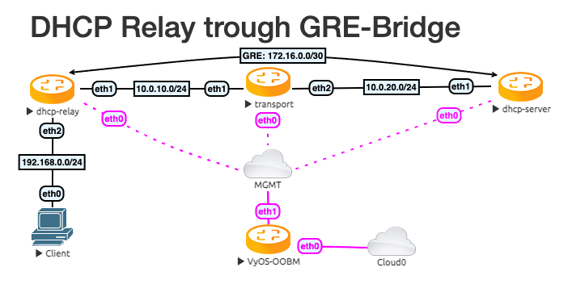

############################
DHCP Relay trough GRE-Bridge
############################

| Testdate: 2022-06-10
| Version: 1.4-rolling-202206100921

This simple structure shows how to configure a DHCP Relay over a GRE Bridge
interface.

********
Topology
********

The topology has 3 VyOS routers and one client. Between the DHCP Server and
the DHCP Relay is a GRE tunnel. The `transport` VyOS represent a large
Network.

*************
Configuration
*************

First, we configure the transport network and the Tunnel interface.

Transport:

.. literalinclude:: _include/transport.conf
   :language: none

DHCP-Server

.. literalinclude:: _include/dhcp-server.conf
   :language: none
   :lines: 1-8

DHCP-Relay

.. literalinclude:: _include/dhcp-relay.conf
   :language: none
   :lines: 1-8

After this, we need the DHCP-Server and Relay configuration.
To get a testable result, we just have one IP in the DHCP range.
Expand it as you need it.

DHCP-Server

.. literalinclude:: _include/dhcp-server.conf
   :language: none
   :lines: 9-13

DHCP-Relay

.. literalinclude:: _include/dhcp-relay.conf
   :language: none
   :lines: 9-10

***************
Test the result
***************

Ping the Client from the DHCP Server.

.. code-block:: none

   vyos@dhcp-server:~$ ping 192.168.0.30 count 4
   PING 192.168.0.30 (192.168.0.30) 56(84) bytes of data.
   64 bytes from 192.168.0.30: icmp_seq=1 ttl=63 time=1.04 ms
   64 bytes from 192.168.0.30: icmp_seq=2 ttl=63 time=1.12 ms
   64 bytes from 192.168.0.30: icmp_seq=3 ttl=63 time=1.13 ms
   64 bytes from 192.168.0.30: icmp_seq=4 ttl=63 time=1.27 ms
   
   --- 192.168.0.30 ping statistics ---
   4 packets transmitted, 4 received, 0% packet loss, time 3004ms
   rtt min/avg/max/mdev = 1.042/1.138/1.271/0.082 ms

And show all DHCP Leases

.. code-block:: none

   vyos@dhcp-server:~$ show dhcp server leases
   IP address    Hardware address    State    Lease start          Lease expiration     Remaining    Pool        Hostname
   ------------  ------------------  -------  -------------------  -------------------  -----------  ----------  ----------
   192.168.0.30  00:50:79:66:68:05   active   2022/06/10 20:03:38  2022/06/11 20:03:38  23:59:17     DHCPTun100  VPCS
