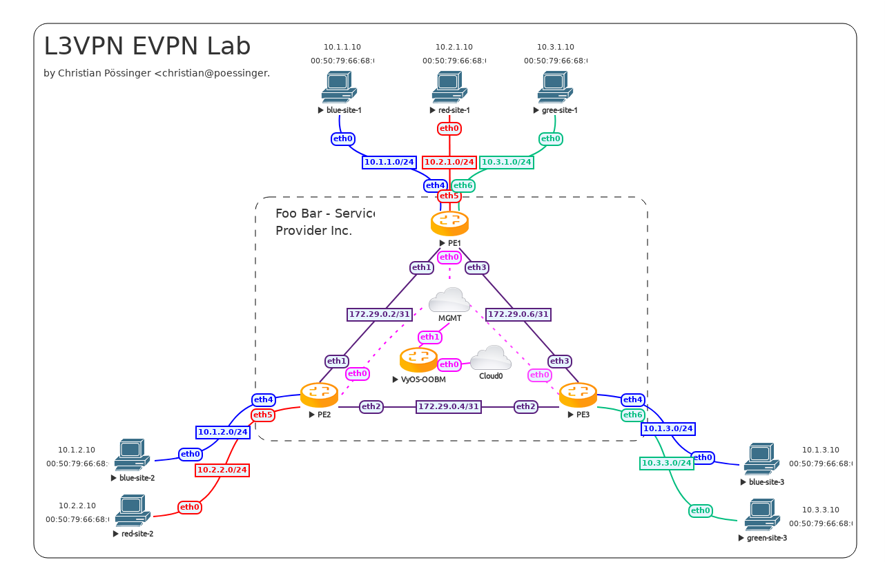

####################
L3VPN EVPN with VyOS
####################

| Testdate: 2023-05-11
| Version: 1.4-rolling-202305100734

I spun up a new lab in EVE-NG, which represents this as the
"Foo Bar - Service Provider Inc." that has 3 points of presence (PoP) in random
datacenters/sites named PE1, PE2, and PE3. Each PoP aggregates at least two
customers.

I named the customers blue, red and green which is common practice in
VRF (Virtual Routing and Forwarding) documentation scenarios.

* PE1 is located in an industrial area that holds multiple office buildings.
  All customers have a site in this area.
* PE2 is located in a smaller area where by coincidence two customers
  (blue and red) share an office building.
* PE3 is located in a smaller area where by coincidence two customers
  (blue and green) are located.

**************
Management VRF
**************

A brief excursion into VRFs: This has been one of the longest-standing feature
requests of VyOS (dating back to 2016) which can be described as
"a VLAN for layer 2 is what a VRF is for layer 3". 
With VRFs, a router/system can hold multiple, isolated routing tables on the
same system. If you wonder what's the difference between multiple tables that
people used for policy-based routing since forever, it's that a VRF also
isolates connected routes rather than just static and dynamically learned
routes, so it allows NICs in different VRFs to use conflicting network
ranges without issues.

VyOS 1.3 added initial support for VRFs (including IPv4/IPv6 static routing)
and VyOS 1.4 now enables full dynamic routing protocol support for
OSPF, IS-IS, and BGP for individual VRFs.

The lab I built is using a VRF (called **mgmt**) to provide out-of-band
SSH access to the PE (Provider Edge) routers. 

.. literalinclude:: _include/PE1.conf
   :language: none
   :lines: 1-6

********
Topology
********

We use the following network topology in this example:

************
Core network
************

I chose to run OSPF as the IGP (Interior Gateway Protocol).
All required BGP sessions are established via a dummy interfaces
(similar to the loopback, but in Linux you can have only one loopback,
while there can be many dummy interfaces) on the PE routers. In case of a link
failure, traffic is diverted in the other direction in this triangle setup and
BGP sessions will not go down. One could even enable
BFD (Bidirectional Forwarding Detection) on the links for a faster
failover and resilience in the network.

Regular VyOS users will notice that the BGP syntax has changed in VyOS 1.4 from
even the prior post about this subject. This is due to T1711, where it was
finally decided to get rid of the redundant BGP ASN (Autonomous System Number)
specification on the CLI and move it to a single leaf node
(set protocols bgp local-as).

It's important to note that all your existing configurations will be migrated
automatically on image upgrade. Nothing to do on your side.

PE1

.. literalinclude:: _include/PE1.conf
   :language: none
   :lines: 8-38

PE2

.. literalinclude:: _include/PE2.conf
   :language: none
   :lines: 8-38

PE3

.. literalinclude:: _include/PE3.conf
   :language: none
   :lines: 8-38

**********************
Tenant networks (VRFs)
**********************

Once all routers can be safely remotely managed and the core network is
operational, we can now setup the tenant networks.

Every tenant is assigned an individual VRF that would support overlapping
address ranges for customers blue, red and green. In our example,
we do not use overlapping ranges to make it easier when showing debug commands.

Thus you can easily match it to one of the devices/networks below.

Every router that provides access to a customer network needs to have the
customer network (VRF + VNI) configured. To make our own lives easier,
we utilize the same VRF table id (local routing table number) and
VNI (Virtual Network Identifier) per tenant on all our routers.

* blue uses local routing table id and VNI 2000
* red uses local routing table id and VNI 3000
* green uses local routing table id and VNI 4000

PE1

.. literalinclude:: _include/PE1.conf
   :language: none
   :lines: 40-96

PE2

.. literalinclude:: _include/PE2.conf
   :language: none
   :lines: 40-89

PE3

.. literalinclude:: _include/PE3.conf
   :language: none
   :lines: 40-89

*********************
Testing and debugging
*********************

You managed to come this far, now we want to see the network and routing
tables in action.

Show routes for all VRFs

.. code-block:: none

   vyos@PE1:~$ show ip route vrf all
   Codes: K - kernel route, C - connected, S - static, R - RIP,
          O - OSPF, I - IS-IS, B - BGP, E - EIGRP, N - NHRP,
          T - Table, v - VNC, V - VNC-Direct, A - Babel, F - PBR,
          f - OpenFabric,
          > - selected route, * - FIB route, q - queued, r - rejected, b - backup
          t - trapped, o - offload failure
   
   VRF blue:
   C>* 10.1.1.0/24 is directly connected, br2000, 00:01:13
   B>* 10.1.2.0/24 [200/0] via 172.29.255.2, br2000 onlink, weight 1, 00:00:49
   B>* 10.1.3.0/24 [200/0] via 172.29.255.3, br2000 onlink, weight 1, 00:00:49
   
   VRF default:
   O   172.29.0.2/31 [110/1] is directly connected, eth1, weight 1, 00:01:09
   C>* 172.29.0.2/31 is directly connected, eth1, 00:01:12
   O>* 172.29.0.4/31 [110/2] via 172.29.0.3, eth1, weight 1, 00:00:46
     *                       via 172.29.0.7, eth3, weight 1, 00:00:46
   O   172.29.0.6/31 [110/1] is directly connected, eth3, weight 1, 00:01:09
   C>* 172.29.0.6/31 is directly connected, eth3, 00:01:12
   C>* 172.29.255.1/32 is directly connected, dum0, 00:01:14
   O>* 172.29.255.2/32 [110/20] via 172.29.0.3, eth1, weight 1, 00:00:50
   O>* 172.29.255.3/32 [110/20] via 172.29.0.7, eth3, weight 1, 00:00:45
   
   VRF green:
   C>* 10.3.1.0/24 is directly connected, br4000, 00:01:13
   B>* 10.3.3.0/24 [200/0] via 172.29.255.3, br4000 onlink, weight 1, 00:00:49
   
   VRF mgmt:
   S>* 0.0.0.0/0 [210/0] via 10.100.0.1, eth0, weight 1, 00:01:45
   C>* 10.100.0.0/24 is directly connected, eth0, 00:01:45
   
   VRF red:
   C>* 10.2.1.0/24 is directly connected, br3000, 00:01:13
   B>* 10.2.2.0/24 [200/0] via 172.29.255.2, br3000 onlink, weight 1, 00:00:49

Information about Ethernet Virtual Private Networks

.. code-block:: none

   vyos@PE1:~$ show bgp l2vpn evpn
   BGP table version is 1, local router ID is 172.29.255.1
   Status codes: s suppressed, d damped, h history, * valid, > best, i - internal
   Origin codes: i - IGP, e - EGP, ? - incomplete
   EVPN type-1 prefix: [1]:[EthTag]:[ESI]:[IPlen]:[VTEP-IP]:[Frag-id]
   EVPN type-2 prefix: [2]:[EthTag]:[MAClen]:[MAC]:[IPlen]:[IP]
   EVPN type-3 prefix: [3]:[EthTag]:[IPlen]:[OrigIP]
   EVPN type-4 prefix: [4]:[ESI]:[IPlen]:[OrigIP]
   EVPN type-5 prefix: [5]:[EthTag]:[IPlen]:[IP]
   
      Network          Next Hop            Metric LocPrf Weight Path
   Route Distinguisher: 10.1.1.1:5
   *> [5]:[0]:[24]:[10.1.1.0]
                       172.29.255.1             0         32768 ?
                       ET:8 RT:100:2000 Rmac:4e:bb:3c:ba:bd:a6
   Route Distinguisher: 10.1.2.1:4
   *>i[5]:[0]:[24]:[10.1.2.0]
                       172.29.255.2             0    100      0 ?
                       RT:100:2000 ET:8 Rmac:26:07:da:eb:fc:ea
   Route Distinguisher: 10.1.3.1:4
   *>i[5]:[0]:[24]:[10.1.3.0]
                       172.29.255.3             0    100      0 ?
                       RT:100:2000 ET:8 Rmac:26:98:28:24:6e:54
   Route Distinguisher: 10.2.1.1:6
   *> [5]:[0]:[24]:[10.2.1.0]
                       172.29.255.1             0         32768 ?
                       ET:8 RT:100:3000 Rmac:50:00:00:01:00:05
   Route Distinguisher: 10.2.2.1:5
   *>i[5]:[0]:[24]:[10.2.2.0]
                       172.29.255.2             0    100      0 ?
                       RT:100:3000 ET:8 Rmac:50:00:00:02:00:05
   Route Distinguisher: 10.3.1.1:7
   *> [5]:[0]:[24]:[10.3.1.0]
                       172.29.255.1             0         32768 ?
                       ET:8 RT:100:4000 Rmac:50:00:00:01:00:06
   Route Distinguisher: 10.3.3.1:6
   *>i[5]:[0]:[24]:[10.3.3.0]
                       172.29.255.3             0    100      0 ?
                       RT:100:4000 ET:8 Rmac:06:32:9d:22:55:8a
   
   Displayed 7 out of 7 total prefixes

If we need to retrieve information about a specific host/network inside
the EVPN network we need to run

.. code-block:: none

   vyos@PE2:~$ show bgp l2vpn evpn 10.3.1.10
   BGP routing table entry for 10.3.1.1:7:[5]:[0]:[24]:[10.3.1.0]
   Paths: (1 available, best #1)
     Not advertised to any peer
     Route [5]:[0]:[24]:[10.3.1.0] VNI 4000
     Local
       172.29.255.1 (metric 20) from 172.29.255.1 (172.29.255.1)
         Origin incomplete, metric 0, localpref 100, valid, internal, best (First path received)
         Extended Community: RT:100:4000 ET:8 Rmac:50:00:00:01:00:06
         Last update: Thu May 11 13:31:13 2023
