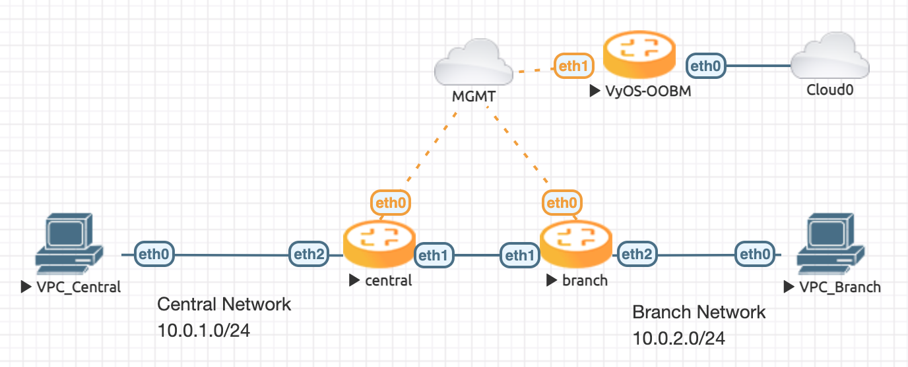

#########
Wireguard
#########

| Testdate: 2022-10-09
| Version: 1.4-rolling-202210090955

This simple structure show how to connect two offices. One remote branch and the
central office.

********
Topology
********

The topology have a central and a branch VyOS router and one client, to
test, in each site.

*************
Configuration
*************

Set the local subnet on eth2 and the public ip address eth1 on each site.

Central

.. literalinclude:: _include/central.conf
   :language: none
   :lines: 1-2

Branch

.. literalinclude:: _include/branch.conf
   :language: none
   :lines: 1-2

Next thing to do, is to create a wireguard keypair on each side.
After this, the public key can be displayed, to save for later.

.. code-block:: none

   vyos@central:~$ generate pki wireguard
   Private key: IAxN76wdmZ6Y0nGzuNSIdSseFELWgAyBsRK0AEyHTV0=
   Public key: g9APk9Pv7EHv0METuXaAguYtoGnn5eSirjZWSKyaT3c=

After you have each public key. The wireguard interfaces can be setup.

Central

.. literalinclude:: _include/central.conf
   :language: none
   :lines: 4-12

Branch

.. literalinclude:: _include/branch.conf
   :language: none
   :lines: 4-12

To reach the network, a route must be set on each VyOS host.
In this structure, a static interface route will fit the requirements.

Central

.. literalinclude:: _include/central.conf
   :language: none
   :lines: 14

Branch

.. literalinclude:: _include/branch.conf
   :language: none
   :lines: 14

*********************
Testing and debugging
*********************

After all is done and commit, let's take a look if the Wireguard interface is
up and running.

.. code-block:: none

   vyos@central:~$ show interfaces wireguard
   Codes: S - State, L - Link, u - Up, D - Down, A - Admin Down
   Interface        IP Address                        S/L  Description
   ---------        ----------                        ---  -----------
   wg01             192.168.0.1/24                    u/u  VPN-to-Branch

And ping the Branch PC from your central router to check the response.

.. code-block:: none

   vyos@central:~$ ping 10.0.2.100 count 4
   PING 10.0.2.100 (10.0.2.100) 56(84) bytes of data.
   64 bytes from 10.0.2.100: icmp_seq=1 ttl=63 time=0.594 ms
   64 bytes from 10.0.2.100: icmp_seq=2 ttl=63 time=0.837 ms
   64 bytes from 10.0.2.100: icmp_seq=3 ttl=63 time=0.768 ms
   64 bytes from 10.0.2.100: icmp_seq=4 ttl=63 time=1.30 ms
   
   --- 10.0.2.100 ping statistics ---
   4 packets transmitted, 4 received, 0% packet loss, time 3102ms
   rtt min/avg/max/mdev = 0.594/0.873/1.296/0.259 ms
