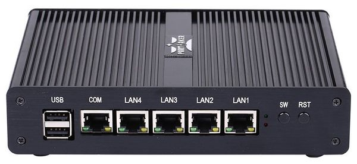
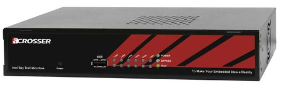
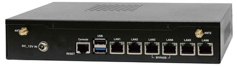
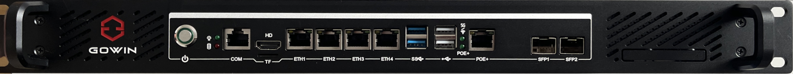
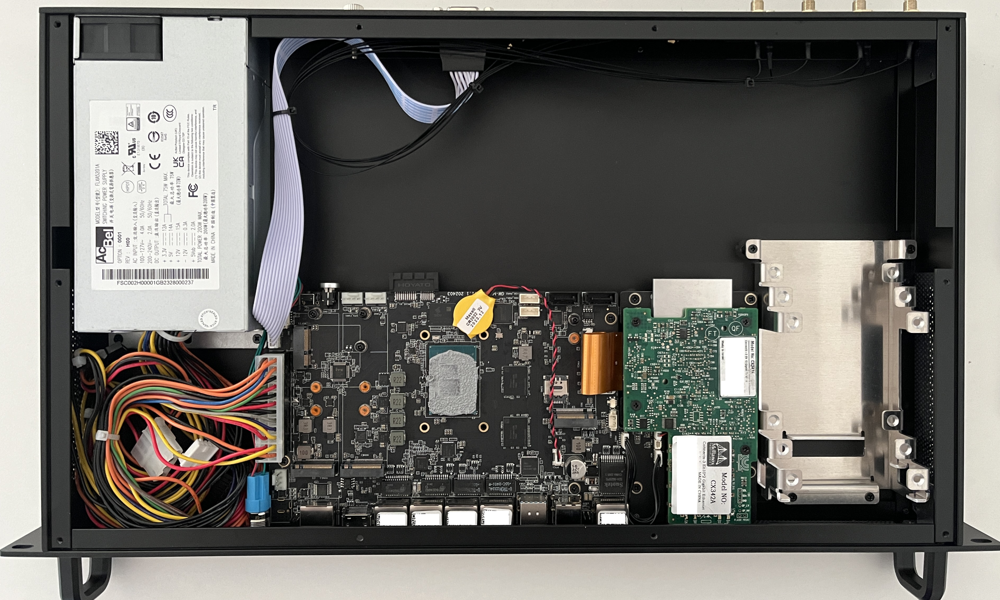
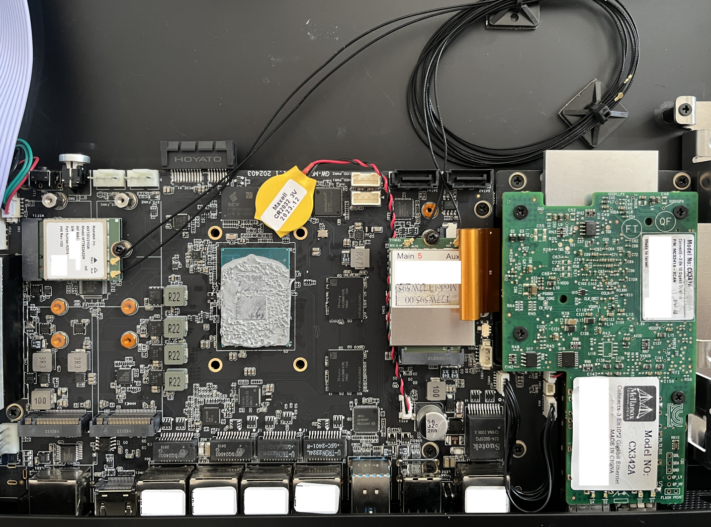
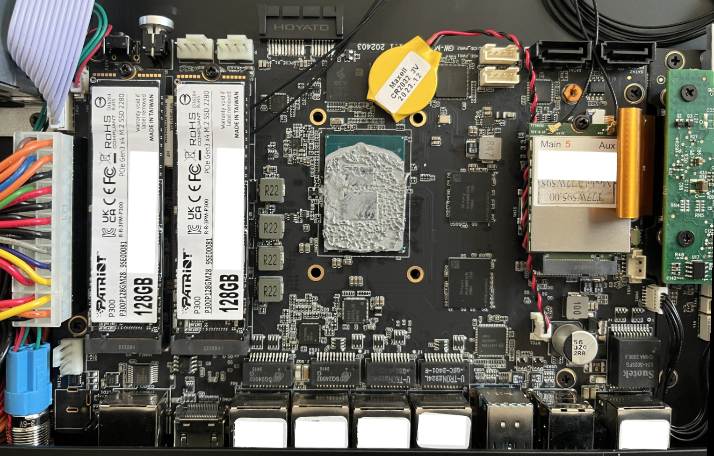

.. _vyosonbaremetal:

#####################
Bare Metal Deployment
#####################

Supermicro A2SDi (Atom C3000)
=============================

I opted to get one of the new Intel Atom C3000 CPUs to spawn VyOS on it.
Running VyOS on an UEFI only device is supported as of VyOS release 1.2.

Shopping Cart
-------------

* 1x Supermicro CSE-505-203B (19" 1U chassis, inkl. 200W PSU)
* 1x Supermicro MCP-260-00085-0B (I/O Shield for A2SDi-2C-HLN4F)
* 1x Supermicro A2SDi-2C-HLN4F (Intel Atom C3338, 2C/2T, 4MB cache, Quad LAN
  with Intel C3000 SoC 1GbE)
* 1x Crucial CT4G4DFS824A (4GB DDR4 RAM 2400 MT/s, PC4-19200)
* 1x SanDisk Ultra Fit 32GB (USB-A 3.0 SDCZ43-032G-G46 mass storage for OS)
* 1x Supermicro MCP-320-81302-0B (optional FAN tray)

Optional (10GE)
---------------
If you want to get additional ethernet ports or even 10GE connectivity
the following optional parts will be required:

* 1x Supermicro RSC-RR1U-E8 (Riser Card)
* 1x Supermicro MCP-120-00063-0N (Riser Card Bracket)

Latest VyOS rolling releases boot without any problem on this board. You also
receive a nice IPMI interface realized with an ASPEED AST2400 BMC (no
information about `OpenBMC <https://www.openbmc.org/>`_ so far on this
motherboard).

Pictures
--------

.. figure:: /_static/images/1u_vyos_back.jpg
   :scale: 25 %
   :alt: CSE-505-203B Back

.. figure:: /_static/images/1u_vyos_front.jpg
   :scale: 25 %
   :alt: CSE-505-203B Front

.. figure:: /_static/images/1u_vyos_front_open_1.jpg
   :scale: 25 %
   :alt: CSE-505-203B Open 1

.. figure:: /_static/images/1u_vyos_front_open_2.jpg
   :scale: 25 %
   :alt: CSE-505-203B Open 2

.. figure:: /_static/images/1u_vyos_front_open_3.jpg
   :scale: 25 %
   :alt: CSE-505-203B Open 3

.. figure:: /_static/images/1u_vyos_front_10ge_open_1.jpg
   :scale: 25 %
   :alt: CSE-505-203B w/ 10GE Open 1

.. figure:: /_static/images/1u_vyos_front_10ge_open_2.jpg
   :scale: 25 %
   :alt: CSE-505-203B w/ 10GE Open 2

.. figure:: /_static/images/1u_vyos_front_10ge_open_3.jpg
   :scale: 25 %
   :alt: CSE-505-203B w/ 10GE Open 3

.. figure:: /_static/images/1u_vyos_front_10ge_open_4.jpg
   :scale: 25 %
   :alt: CSE-505-203B w/ 10GE Open

.. _pc-engines-apu4:

PC Engines APU4
================

As this platform seems to be quite common in terms of noise, cost, power and
performance it makes sense to write a small installation manual.

This guide was developed using an APU4C4 board with the following specs:

* AMD Embedded G series GX-412TC, 1 GHz quad Jaguar core with 64 bit and AES-NI
  support, 32K data + 32K instruction cache per core, shared 2MB L2 cache.
* 4 GB DDR3-1333 DRAM, with optional ECC support
* About 6 to 10W of 12V DC power depending on CPU load
* 2 miniPCI express (one with SIM socket for 3G modem).
* 4 Gigabit Ethernet channels using Intel i211AT NICs

The board can be powered via 12V from the front or via a 5V onboard connector.

.. _vyos-on-baremetal:apu4_shopping:

Shopping Cart
-------------

* 1x apu4c4 = 4 i211AT LAN / AMD GX-412TC CPU / 4 GB DRAM / dual SIM
* 1x Kingston SUV500MS/120G
* 1x VARIA Group Item 326745 19" dual rack for APU4

The 19" enclosure can accommodate up to two APU4 boards - there is a single and
dual front cover.

Extension Modules
^^^^^^^^^^^^^^^^^

WiFi
""""

Refer to :ref:`wireless-interface` for additional information, below listed
modules have been tested successfully on this Hardware platform:

* Compex WLE900VX mini-PCIe WiFi module, only supported in mPCIe slot 1.
* Intel Corporation AX200 mini-PCIe WiFi module, only supported in mPCIe slot 1.
  (see :ref:`wireless-interface-intel-ax200`)

WWAN
""""

Refer to :ref:`wwan-interface` for additional information, below listed modules
have been tested successfully on this Hardware platform using VyOS 1.3
(equuleus):

* Sierra Wireless AirPrime MC7304 miniPCIe card (LTE)
* Sierra Wireless AirPrime MC7430 miniPCIe card (LTE)
* Sierra Wireless AirPrime MC7455 miniPCIe card (LTE)
* Sierra Wireless AirPrime MC7710 miniPCIe card (LTE)
* Huawei ME909u-521 miniPCIe card (LTE)

VyOS 1.2 (crux)
---------------

Depending on the VyOS versions you intend to install there is a difference in
the serial port settings (:vytask:`T1327`).

Create a bootable USB pendrive using e.g. Rufus_ on a Windows machine.

Connect serial port to a PC through null modem cable (RXD / TXD crossed over).
Set terminal emulator to 115200 8N1.

.. stop_vyoslinter
.. code-block:: none

  PC Engines apu4
  coreboot build 20171130
  BIOS version v4.6.4
  4080 MB ECC DRAM
  SeaBIOS (version rel-1.11.0.1-0-g90da88d)

  Press F10 key now for boot menu:

  Select boot device:

  1. ata0-0: KINGSTON SUV500MS120G ATA-11 Hard-Disk (111 GiBytes)
  2. USB MSC Drive Generic Flash Disk 8.07
  3. Payload [memtest]
  4. Payload [setup]

.. start_vyoslinter

Now boot from the ``USB MSC Drive Generic Flash Disk 8.07`` media by pressing
``2``, the VyOS boot menu will appear, just wait 10 seconds or press ``Enter``
to continue.

.. code-block:: none

  lqqqqqqqqqqqqqqqqqqqqqqqqqqqqqqqqqqqqqqqqqqqqqqqqqqqqqqqqqqqqk
  x                      VyOS - Boot Menu                      x
  tqqqqqqqqqqqqqqqqqqqqqqqqqqqqqqqqqqqqqqqqqqqqqqqqqqqqqqqqqqqqu
  x Live (amd64-vyos)                                          x
  x Live (amd64-vyos failsafe)                                 x
  x                                                            x
  mqqqqqqPress ENAutomatic boot in 10 seconds...nu entryqqqqqqqj

The image will be loaded and the last lines you will get will be:

.. code-block:: none

  Loading /live/vmlinuz... ok
  Loading /live/initrd.img...

The Kernel will now spin up using a different console setting. Set terminal
emulator to 9600 8N1 and after a while your console will show:

.. code-block:: none

  Loading /live/vmlinuz... ok
  Loading /live/initrd.img...
  Welcome to VyOS - vyos ttyS0

  vyos login:

You can now proceed with a regular image installation as described in
:ref:`installation`.

As the APU board itself still used a serial setting of 115200 8N1 it is
strongly recommended that you change the VyOS serial interface settings after
your first successful boot.

Use the following command to adjust the :ref:`serial-console` settings:

.. code-block:: none

  set system console device ttyS0 speed 115200

.. note:: Once you ``commit`` the above changes access to the serial interface
   is lost until you set your terminal emulator to 115200 8N1 again.

.. code-block:: none

  vyos@vyos# show system console
   device ttyS0 {
     speed 115200
   }

VyOS 1.2 (rolling)
------------------

Installing the rolling release on an APU2 board does not require any change
on the serial console from your host side as :vytask:`T1327` was successfully
implemented.

Simply proceed with a regular image installation as described in
:ref:`installation`.

.. _vyos-on-baremetal:apu4_pictures:

Pictures
--------

.. note:: Both device types operate without any moving parts and emit zero
   noise.

Rack Mount
^^^^^^^^^^

.. figure:: /_static/images/apu4_rack_1.jpg
   :scale: 25 %
   :alt: APU4 rack closed

.. figure:: /_static/images/apu4_rack_2.jpg
   :scale: 25 %
   :alt: APU4 rack front

.. figure:: /_static/images/apu4_rack_3.jpg
   :scale: 25 %
   :alt: APU4 rack module #1

.. figure:: /_static/images/apu4_rack_4.jpg
   :scale: 25 %
   :alt: APU4 rack module #2

.. figure:: /_static/images/apu4_rack_5.jpg
   :scale: 25 %
   :alt: APU4 rack module #3 with PSU

VyOS custom print
"""""""""""""""""

.. figure:: /_static/images/apu4_rack_vyos_print.jpg
   :scale: 25 %
   :alt: APU4 custom VyOS powder coat

Desktop / Bench Top
^^^^^^^^^^^^^^^^^^^

.. figure:: /_static/images/apu4_desk_1.jpg
   :scale: 25 %
   :alt: APU4 desktop closed

.. figure:: /_static/images/apu4_desk_2.jpg
   :scale: 25 %
   :alt: APU4 desktop closed

.. figure:: /_static/images/apu4_desk_3.jpg
   :scale: 25 %
   :alt: APU4 desktop back

.. figure:: /_static/images/apu4_desk_4.jpg
   :scale: 25 %
   :alt: APU4 desktop back

.. _Rufus: https://rufus.ie/

Qotom Q355G4
============

The install on this Q355G4 box is pretty much plug and play. The port numbering
the OS does might differ from the labels on the outside, but the UEFI firmware
has a port blink test built in with MAC addresses so you can very quickly
identify which is which. MAC labels are on the inside as well, and this test
can be done from VyOS or plain Linux too. Default settings in the UEFI will
make it boot, but depending on your installation wishes (i.e. storage type,
boot type, console type) you might want to adjust them. This Qotom company
seems to be the real OEM/ODM for many other relabelling companies like
Protectli.

Hardware
--------

There are a number of other options, but they all seem to be close to Intel
reference designs, with added features like more serial ports, more network
interfaces and the likes. Because they don't deviate too much from standard
designs all the hardware is well-supported by mainline. It accepts one LPDDR3
SO-DIMM, but chances are that if you need more than that, you'll also want
something even beefier than an i5. There are options for antenna holes, and SIM
slots, so you could in theory add an LTE/Cell modem (not tested so far).

The chassis is a U-shaped alu extrusion with removable I/O plates and removable
bottom plate. Cooling is completely passive with a heatsink on the SoC with
internal and external fins, a flat interface surface, thermal pad on top of
that, which then directly attaches to the chassis, which has fins as well. It
comes with mounting hardware and rubber feet, so you could place it like a
desktop model or mount it on a VESA mount, or even wall mount it with the
provided mounting plate. The closing plate doubles as internal 2.5" mounting
place for an HDD or SSD, and comes supplied with a small SATA cable and SATA
power cable.

Power supply is a 12VDC barrel jack, and included switching power supply, which
is why SATA power regulation is on-board. Internally it has a NUC-board-style
on-board 12V input header as well, the molex locking style.

There are WDT options and auto-boot on power enable, which is great for remote
setups. Firmware is reasonably secure (no backdoors found, BootGuard is enabled
in enforcement mode, which is good but also means no coreboot option), yet has
most options available to configure (so it's not locked out like most firmwares
are).

An external RS232 serial port is available, internally a GPIO header as well.
It does have Realtek based audio on board for some reason, but you can disable
that. Booting works on both USB2 and USB3 ports. Switching between serial BIOS
mode and HDMI BIOS mode depends on what is connected at startup; it goes into
serial mode if you disconnect HDMI and plug in serial, in all other cases it's
HDMI mode.

Partaker i5
===========

I believe this is actually the same hardware as the Protectli. I purchased it
in June 2018. It came pre-loaded with pfSense.

`Manufacturer product page <http://www.inctel.com.cn/product/detail/338.html>`_.

Installation
------------

* Write VyOS ISO to USB drive of some sort
* Plug in VGA, power, USB keyboard, and USB drive
* Press "SW" button on the front (this is the power button; I don't know what
  "SW" is supposed to mean).
* Begin rapidly pressing delete on the keyboard. The boot prompt is very quick,
  but with a few tries you should be able to get into the BIOS.
* Chipset > South Bridge > USB Configuration: set XHCI to Disabled and USB 2.0
  (EHCI) to Enabled. Without doing this, the USB drive won't boot.
* Boot to the VyOS installer and install as usual.

Warning the interface labels on my device are backwards; the left-most "LAN4"
port is eth0 and the right-most "LAN1" port is eth3.

Acrosser AND-J190N1
===================

This microbox network appliance was build to create OpenVPN bridges. It can
saturate a 100Mbps link. It is a small (serial console only) PC with 6 Gb LAN

You may have to add your own RAM and HDD/SSD. There is no VGA connector. But
Acrosser provides a DB25 adapter for the VGA header on the motherboard (not
used).

BIOS Settings:
--------------

First thing you want to do is getting a more user friendly console to configure
BIOS. Default VT100 brings a lot of issues. Configure VT100+ instead.

For practical issues change speed from 115200 to 9600. 9600 is the default
speed at which both linux kernel and VyOS will reconfigure the serial port
when loading.

Connect to serial (115200bps). Power on the appliance and press Del in the
console when requested to enter BIOS settings.

Advanced > Serial Port Console Redirection > Console Redirection Settings:

* Terminal Type : VT100+
* Bits per second : 9600

Save, reboot and change serial speed to 9600 on your client.

Some options have to be changed for VyOS to boot correctly. With XHCI enabled
the installer can’t access the USB key. Enable EHCI instead.

Reboot into BIOS, Chipset > South Bridge > USB Configuration:

* Disable XHCI
* Enable USB 2.0 (EHCI) Support

Install VyOS:
-------------

Create a VyOS bootable USB key. I used the 64-bit ISO (VyOS 1.1.7) and
`LinuxLive USB Creator <http://www.linuxliveusb.com/>`_.

I'm not sure if it helps the process but I changed default option to live-serial
(line “default xxxx”) on the USB key under syslinux/syslinux.cfg.

I connected the key to one black USB port on the back and powered on. The first
VyOS screen has some readability issues. Press :kbd:`Enter` to continue.

Then VyOS should boot and you can perform the ``install image``

.. _gowin_gw-fn-1ur1-10g:

Gowin GW-FN-1UR1-10G
====================

A platform utilizing an Intel Alder Lake-N100 CPU with 6M cache, TDP 6W.
Onboard LPDDR5 16GB RAM and 128GB eMMC (can be used for image installation).

The appliance comes with 2 * 2.5GbE Intel I226-V and 3 * 1GbE Intel I210
where one supports IEEE802.3at PoE+ (Typical 30W).

In addition there is a Mellanox ConnectX-3 2* 10GbE SFP+ NIC available.

**NOTE:** This is the entry level platform. Other derivates exists with
i3-N305 CPU and 2x 25GbE!

Shopping Cart
-------------

* 1x Gowin GW-FN-1UR1-10G
* 2x 128GB M.2 NVMe SSDs

Optional (WiFi + WWAN)
----------------------

* 1x MediaTek 7921E M.2 NGFF WIFI module (not tested as this currently leads to a Kernel crash)
* 1x HP LT4120 Snapdragon X5 LTE WWAN module

Pictures
--------

Cooling
-------

The device itself is passivly cooled, whereas the power supply has an active fan.
Even if the main processor is powered off, the power supply fan is operating and
the entire chassis draws 7.5W. During operation the chassis drew arround 38W.

BIOS Settings
-------------

No settings needed to be altered, everything worked out of the box!

Installation
------------

The system provides a regular RS232 console port using 115200,8n1 setting which
is sufficient to install VyOS from a USB pendrive.

First Boot
----------

Please note that there is a weirdness on the network interface mapping.
The interface <-> MAC mapping is going upwards but the NICs are placed
somehow swapped on the mainboard/MACs programmed in a swapped order.

See interface description for more detailed mapping.

.. code-block:: none

   vyos@vyos:~$ show interfaces
   Codes: S - State, L - Link, u - Up, D - Down, A - Admin Down
   Interface    IP Address      MAC                VRF        MTU  S/L    Description
   -----------  --------------  -----------------  -------  -----  -----  -------------
   eth0         -               00:f0:cb:00:00:99  default   1500  u/D    Intel I226-V - Front eth2
   eth1         -               00:f0:cb:00:00:9a  default   1500  u/D    Intel I226-V - Front eth1
   eth2         -               00:f0:cb:00:00:9b  default   1500  u/D    Intel I210 - Front eth4
   eth3         -               00:f0:cb:00:00:9c  default   1500  u/D    Intel I210 - Front eth3
   eth4         -               00:f0:cb:00:00:9d  default   1500  u/D    Intel I210 - Front POE
   eth5         -               00:02:c9:00:00:30  default   1500  u/D    Mellanox ConnectX-3 - SFP2
   eth6         -               00:02:c9:00:00:31  default   1500  u/D    Mellanox ConnectX-3 - SFP1
   lo           127.0.0.1/8     00:00:00:00:00:00  default  65536  u/u
                ::1/128
   wwan0        -               d2:39:76:8e:05:12  default   1500  A/D

VyOS 1.4 (sagitta)
^^^^^^^^^^^^^^^^^^

Connect serial port to a PC through a USB <-> RJ45 console cable. Set terminal emulator
to 115200 8N1. You can also perform the installation using VGA or HDMI ports.

In this example I choose to install VyOS as RAID-1 on both NVMe drives. However, a previous
installation on the 128GB eMMC storage worked without any issues, too.

.. code-block:: none

  Welcome to VyOS - vyos ttyS0

  vyos login:

Perform Image installation using `install image` CLI command. This installation uses two 128GB NVMe
disks setup as RAID1.

.. code-block:: none

   Welcome to VyOS!

      ┌── ┐
      . VyOS 1.4.0
      └ ──┘  sagitta

   * Support portal: https://support.vyos.io
   * Documentation:  https://docs.vyos.io/en/sagitta
   * Project news:   https://blog.vyos.io
   * Bug reports:    https://vyos.dev

   You can change this banner using "set system login banner post-login" command.

   VyOS is a free software distribution that includes multiple components,
   you can check individual component licenses under /usr/share/doc/*/copyright
   Use of this pre-built image is governed by the EULA you can find in
   /usr/share/vyos/EULA

   vyos@vyos:~$ install image

   Welcome to VyOS installation!
   This command will install VyOS to your permanent storage.
   Would you like to continue? [y/N] y

   What would you like to name this image? (Default: 1.4.0)

   Please enter a password for the "vyos" user:
   Please confirm password for the "vyos" user:

   What console should be used by default? (K: KVM, S: Serial)? (Default: S)

   Probing disks
   4 disk(s) found
   Would you like to configure RAID-1 mirroring? [Y/n] y

   The following disks were found:
         /dev/sda (14.4 GB)
         /dev/mmcblk0 (116.5 GB)
   Would you like to configure RAID-1 mirroring on them? [Y/n] n

   Would you like to choose two disks for RAID-1 mirroring? [Y/n] y
   Disks available:
         1: /dev/sda     (14.4 GB)
         2: /dev/mmcblk0 (116.5 GB)
         3: /dev/nvme1n1 (119.2 GB)
         4: /dev/nvme0n1 (119.2 GB)
   Select first disk: 3

   Remaining disks:
         1: /dev/sda     (14.4 GB)
         2: /dev/mmcblk0 (116.5 GB)
         3: /dev/nvme0n1 (119.2 GB)
   Select second disk: 3

   Installation will delete all data on both drives. Continue? [y/N] y

   Searching for data from previous installations
   No previous installation found
   Creating partitions on /dev/nvme1n1
   Creating partition table...
   Creating partitions on /dev/nvme0n1
   Creating partition table...
   Creating RAID array
   Updating initramfs
   Creating filesystem on RAID array
   The following config files are available for boot:
         1: /opt/vyatta/etc/config/config.boot
         2: /opt/vyatta/etc/config.boot.default

   Which file would you like as boot config? (Default: 1)
   Creating temporary directories
   Mounting new partitions
   Creating a configuration file
   Copying system image files
   Installing GRUB configuration files
   Installing GRUB to the drives
   Cleaning up
   Unmounting target filesystems
   Removing temporary files
   The image installed successfully; please reboot now.

Hardware
--------

.. code-block:: none

   vyos@vyos:~$ lspci
   00:00.0 Host bridge: Intel Corporation Device 461c
   00:02.0 VGA compatible controller: Intel Corporation Alder Lake-N [UHD Graphics]
   00:0a.0 Signal processing controller: Intel Corporation Platform Monitoring Technology (rev 01)
   00:0d.0 USB controller: Intel Corporation Device 464e
   00:14.0 USB controller: Intel Corporation Device 54ed
   00:14.2 RAM memory: Intel Corporation Device 54ef
   00:15.0 Serial bus controller: Intel Corporation Device 54e8
   00:16.0 Communication controller: Intel Corporation Device 54e0
   00:1a.0 SD Host controller: Intel Corporation Device 54c4
   00:1c.0 PCI bridge: Intel Corporation Device 54b8
   00:1c.2 PCI bridge: Intel Corporation Device 54ba
   00:1c.3 PCI bridge: Intel Corporation Device 54bb
   00:1c.6 PCI bridge: Intel Corporation Device 54be
   00:1d.0 PCI bridge: Intel Corporation Device 54b0
   00:1f.0 ISA bridge: Intel Corporation Device 5481
   00:1f.4 SMBus: Intel Corporation Device 54a3
   00:1f.5 Serial bus controller: Intel Corporation Device 54a4
   01:00.0 PCI bridge: ASMedia Technology Inc. Device 1806 (rev 01)
   02:00.0 PCI bridge: ASMedia Technology Inc. Device 1806 (rev 01)
   02:02.0 PCI bridge: ASMedia Technology Inc. Device 1806 (rev 01)
   02:06.0 PCI bridge: ASMedia Technology Inc. Device 1806 (rev 01)
   02:0e.0 PCI bridge: ASMedia Technology Inc. Device 1806 (rev 01)
   03:00.0 Ethernet controller: Intel Corporation Ethernet Controller I226-V (rev 04)
   04:00.0 Ethernet controller: Intel Corporation Ethernet Controller I226-V (rev 04)
   05:00.0 Network controller: MEDIATEK Corp. MT7922 802.11ax PCI Express Wireless Network Adapter
   06:00.0 SATA controller: ASMedia Technology Inc. Device 0622 (rev 01)
   07:00.0 PCI bridge: ASMedia Technology Inc. Device 1806 (rev 01)
   08:00.0 PCI bridge: ASMedia Technology Inc. Device 1806 (rev 01)
   08:02.0 PCI bridge: ASMedia Technology Inc. Device 1806 (rev 01)
   08:06.0 PCI bridge: ASMedia Technology Inc. Device 1806 (rev 01)
   08:0e.0 PCI bridge: ASMedia Technology Inc. Device 1806 (rev 01)
   09:00.0 Ethernet controller: Intel Corporation I210 Gigabit Network Connection (rev 03)
   0a:00.0 Ethernet controller: Intel Corporation I210 Gigabit Network Connection (rev 03)
   0b:00.0 Ethernet controller: Intel Corporation I210 Gigabit Network Connection (rev 03)
   0d:00.0 Non-Volatile memory controller: Device 1ed0:2283
   0f:00.0 Non-Volatile memory controller: Device 1ed0:2283
   11:00.0 Ethernet controller: Mellanox Technologies MT27500 Family [ConnectX-3]

.. code-block:: none

   vyos@vyos:~$ lsusb
   Bus 004 Device 001: ID 1d6b:0003 Linux Foundation 3.0 root hub
   Bus 003 Device 005: ID 0e8d:c616 MediaTek Inc. Wireless_Device
   Bus 003 Device 003: ID 413c:2113 Dell Computer Corp. KB216 Wired Keyboard
   Bus 003 Device 004: ID 03f0:9d1d HP, Inc HP lt4120 Snapdragon X5 LTE
   Bus 003 Device 002: ID 05e3:0610 Genesys Logic, Inc. Hub
   Bus 003 Device 001: ID 1d6b:0002 Linux Foundation 2.0 root hub
   Bus 002 Device 002: ID 05e3:0620 Genesys Logic, Inc. GL3523 Hub
   Bus 002 Device 001: ID 1d6b:0003 Linux Foundation 3.0 root hub
   Bus 001 Device 001: ID 1d6b:0002 Linux Foundation 2.0 root hub

WWAN
^^^^

The LTE module can be enabled as simple as this config snippet:

.. code-block:: none

   interfaces {
      wwan wwan0 {
         address "dhcp"
         apn "YOUR-APN-GOES-HERE"
      }
   }

For more information please refer to chapter: :ref:`wwan-interface`
