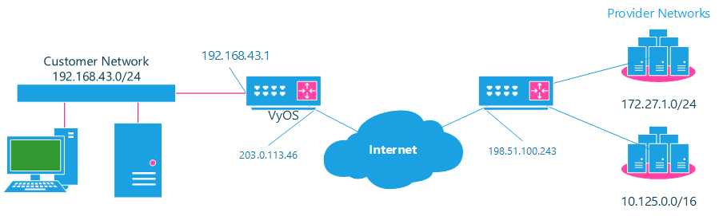

.. _nat:

NAT
===

.. _source-nat:

Source NAT
----------

Source NAT is typically referred to simply as NAT. To be more correct, what
most people refer to as NAT is actually the process of **Port Address
Translation (PAT)**, or **NAT Overload**. The process of having many internal
host systems communicate to the Internet using a single or subset of IP
addresses.

To setup SNAT, we need to know:

* The internal IP addresses we want to translate;
* The outgoing interface to perform the translation on;
* The external IP address to translate to.

In the example used for the Quick Start configuration above, we demonstrate
the following configuration:

.. code-block:: none

  set nat source rule 100 outbound-interface 'eth0'
  set nat source rule 100 source address '192.168.0.0/24'
  set nat source rule 100 translation address 'masquerade'

Which generates the following configuration:

.. code-block:: none

  rule 100 {
      outbound-interface eth0
      source {
          address 192.168.0.0/24
      }
      translation {
          address masquerade
      }
  }

In this example, we use **masquerade** as the translation address instead of
an IP address. The **masquerade** target is effectively an alias to say "use
whatever IP address is on the outgoing interface", rather than a statically
configured IP address. This is useful if you use DHCP for your outgoing
interface and do not know what the external address will be.

When using NAT for a large number of host systems it recommended that a
minimum of 1 IP address is used to NAT every 256 host systems. This is due to
the limit of 65,000 port numbers available for unique translations and a
reserving an average of 200-300 sessions per host system.

Example: For an ~8,000 host network a source NAT pool of 32 IP addresses is
recommended.

A pool of addresses can be defined by using a **-** in the
`set nat source rule [n] translation address` statement.

.. code-block:: none

  set nat source rule 100 translation address '203.0.113.32-203.0.113.63'

.. note:: Avoiding "leaky" NAT

Linux netfilter will not NAT traffic marked as INVALID. This often confuses
people into thinking that Linux (or specifically VyOS) has a broken NAT
implementation because non-NATed traffic is seen leaving an external interface.
This is actually working as intended, and a packet capture of the "leaky"
traffic should reveal that the traffic is either an additional TCP "RST",
"FIN,ACK", or "RST,ACK" sent by client systems after Linux netfilter considers
the connection closed. The most common is the additional TCP RST some host
implementations send after terminating a connection (which is implementation-
specific).

In other words, connection tracking has already observed the connection be
closed and has transition the flow to INVALID to prevent attacks from
attempting to reuse the connection.

You can avoid the "leaky" behavior by using a firewall policy that drops
"invalid" state packets.

Having control over the matching of INVALID state traffic, e.g. the ability to
selectively log, is an important troubleshooting tool for observing broken
protocol behavior. For this reason, VyOS does not globally drop invalid state
traffic, instead allowing the operator to make the determination on how the
traffic is handled.

NAT Reflection/Hairpin NAT
^^^^^^^^^^^^^^^^^^^^^^^^^^

.. note:: Avoiding NAT breakage in the absence of split-DNS

A typical problem with using NAT and hosting public servers is the ability for
internal systems to reach an internal server using it's external IP address.
The solution to this is usually the use of split-DNS to correctly point host
systems to the internal address when requests are made internally. Because
many smaller networks lack DNS infrastructure, a work-around is commonly
deployed to facilitate the traffic by NATing the request from internal hosts
to the source address of the internal interface on the firewall. This technique
is commonly referred to as **NAT Reflection**, or **Hairpin NAT**.

In this example, we will be using the example Quick Start configuration above
as a starting point.

To setup a NAT reflection rule, we need to create a rule to NAT connections
from the internal network to the same internal network to use the source
address of the internal interface.

.. code-block:: none

  set nat source rule 110 description 'NAT Reflection: INSIDE'
  set nat source rule 110 destination address '192.168.0.0/24'
  set nat source rule 110 outbound-interface 'eth1'
  set nat source rule 110 source address '192.168.0.0/24'
  set nat source rule 110 translation address 'masquerade'

Which results in a configuration of:

.. code-block:: none

  rule 110 {
      description "NAT Reflection: INSIDE"
      destination {
          address 192.168.0.0/24
      }
      outbound-interface eth1
      source {
          address 192.168.0.0/24
      }
      translation {
          address masquerade
      }
  }

Destination NAT
---------------

DNAT is typically referred to as a **Port Forward**. When using VyOS as a NAT
router and firewall, a common configuration task is to redirect incoming
traffic to a system behind the firewall.

In this example, we will be using the example Quick Start configuration above
as a starting point.

To setup a destination NAT rule we need to gather:

* The interface traffic will be coming in on;
* The protocol and port we wish to forward;
* The IP address of the internal system we wish to forward traffic to.

In our example, we will be forwarding web server traffic to an internal web
server on 192.168.0.100. HTTP traffic makes use of the TCP protocol on port 80.
For other common port numbers, see: https://en.wikipedia.org/wiki/List_of_TCP_and_UDP_port_numbers

Our configuration commands would be:

.. code-block:: none

  set nat destination rule 10 description 'Port Forward: HTTP to 192.168.0.100'
  set nat destination rule 10 destination port '80'
  set nat destination rule 10 inbound-interface 'eth0'
  set nat destination rule 10 protocol 'tcp'
  set nat destination rule 10 translation address '192.168.0.100'

Which would generate the following NAT destination configuration:

.. code-block:: none

  nat {
      destination {
          rule 10 {
              description "Port Forward: HTTP to 192.168.0.100"
              destination {
                  port 80
              }
              inbound-interface eth0
              protocol tcp
              translation {
                  address 192.168.0.100
              }
          }
      }
  }

.. note:: If forwarding traffic to a different port than it is arriving on,
   you may also configure the translation port using
   `set nat destination rule [n] translation port`.

This establishes our Port Forward rule, but if we created a firewall policy it
will likely block the traffic.

It is important to note that when creating firewall rules that the DNAT
translation occurs **before** traffic traverses the firewall. In other words,
the destination address has already been translated to 192.168.0.100.

So in our firewall policy, we want to allow traffic coming in on the outside
interface, destined for TCP port 80 and the IP address of 192.168.0.100.

.. code-block:: none

  set firewall name OUTSIDE-IN rule 20 action 'accept'
  set firewall name OUTSIDE-IN rule 20 destination address '192.168.0.100'
  set firewall name OUTSIDE-IN rule 20 destination port '80'
  set firewall name OUTSIDE-IN rule 20 protocol 'tcp'
  set firewall name OUTSIDE-IN rule 20 state new 'enable'

This would generate the following configuration:

.. code-block:: none

  rule 20 {
      action accept
      destination {
          address 192.168.0.100
          port 80
      }
      protocol tcp
      state {
          new enable
      }
  }

.. note::

  If you have configured the `INSIDE-OUT` policy, you will need to add
  additional rules to permit inbound NAT traffic.

1-to-1 NAT
----------

Another term often used for DNAT is **1-to-1 NAT**. For a 1-to-1 NAT
configuration, both DNAT and SNAT are used to NAT all traffic from an external
IP address to an internal IP address and vice-versa.

Typically, a 1-to-1 NAT rule omits the destination port (all ports) and
replaces the protocol with either **all** or **ip**.

Then a corresponding SNAT rule is created to NAT outgoing traffic for the
internal IP to a reserved external IP. This dedicates an external IP address
to an internal IP address and is useful for protocols which don't have the
notion of ports, such as GRE.

1-to-1 NAT example
------------------

Here's an extract of a simple 1-to-1 NAT configuration with one internal and
one external interface:

.. code-block:: none

  set interfaces ethernet eth0 address '192.168.1.1/24'
  set interfaces ethernet eth0 description 'Inside interface'
  set interfaces ethernet eth1 address '192.0.2.30/24'
  set interfaces ethernet eth1 description 'Outside interface'
  set nat destination rule 2000 description '1-to-1 NAT example'
  set nat destination rule 2000 destination address '192.0.2.30'
  set nat destination rule 2000 inbound-interface 'eth1'
  set nat destination rule 2000 translation address '192.168.1.10'
  set nat source rule 2000 description '1-to-1 NAT example'
  set nat source rule 2000 outbound-interface 'eth1'
  set nat source rule 2000 source address '192.168.1.10'
  set nat source rule 2000 translation address '192.0.2.30'

Firewall rules are written as normal, using the internal IP address as the
source of outbound rules and the destination of inbound rules.

NPTv6
-----

NPTv6 stands for Network Prefix Translation. It's a form of NAT for IPv6. It's
described in :rfc:`6296`. NPTv6 is supported in linux kernel since version 3.13.

Usage
^^^^^

NPTv6 is very useful for IPv6 multihoming. It is also commonly used when the external IPv6 prefix is dynamic,
as it prevents the need for renumbering of internal hosts when the extern prefix changes.

Let's assume the following network configuration:

* eth0 : LAN
* eth1 : WAN1, with 2001:db8:e1::/48 routed towards it
* eth2 : WAN2, with 2001:db8:e2::/48 routed towards it

Regarding LAN hosts addressing, why would you choose 2001:db8:e1::/48 over
2001:db8:e2::/48? What happens when you get a new provider with a different
routed IPv6 subnet?

The solution here is to assign to your hosts ULAs_ and to prefix-translate
their address to the right subnet when going through your router.

* LAN Subnet : fc00:dead:beef::/48
* WAN 1 Subnet : 2001:db8:e1::/48
* WAN 2 Subnet : 2001:db8:e2::/48

* eth0 addr : fc00:dead:beef::1/48
* eth1 addr : 2001:db8:e1::1/48
* eth2 addr : 2001:db8:e2::1/48

VyOS Support
^^^^^^^^^^^^

NPTv6 support has been added in VyOS 1.2 (Crux) and is available through
`nat nptv6` configuration nodes.

.. code-block:: none

  set rule 10 inside-prefix 'fc00:dead:beef::/48'
  set rule 10 outside-interface 'eth1'
  set rule 10 outside-prefix '2001:db8:e1::/48'
  set rule 20 inside-prefix 'fc00:dead:beef::/48'
  set rule 20 outside-interface 'eth2'
  set rule 20 outside-prefix '2001:db8:e2::/48'

Resulting in the following ip6tables rules:

.. code-block:: none

  Chain VYOS_DNPT_HOOK (1 references)
   pkts bytes target   prot opt in   out   source              destination
      0     0 DNPT     all    eth1   any   anywhere            2001:db8:e1::/48  src-pfx 2001:db8:e1::/48 dst-pfx fc00:dead:beef::/48
      0     0 DNPT     all    eth2   any   anywhere            2001:db8:e2::/48  src-pfx 2001:db8:e2::/48 dst-pfx fc00:dead:beef::/48
      0     0 RETURN   all    any    any   anywhere            anywhere
  Chain VYOS_SNPT_HOOK (1 references)
   pkts bytes target   prot opt in   out   source              destination
      0     0 SNPT     all    any    eth1  fc00:dead:beef::/48 anywhere          src-pfx fc00:dead:beef::/48 dst-pfx 2001:db8:e1::/48
      0     0 SNPT     all    any    eth2  fc00:dead:beef::/48 anywhere          src-pfx fc00:dead:beef::/48 dst-pfx 2001:db8:e2::/48
      0     0 RETURN   all    any    any   anywhere            anywhere

NAT before VPN
--------------

Some application service providers (ASPs) operate a VPN gateway to provide access to their internal resources,
and require that a connecting organisation translate all traffic to the service provider network to a source address provided by the ASP.

Example Network
^^^^^^^^^^^^^^^

Here's one example of a network environment for an ASP.
The ASP requests that all connections from this company should come from 172.29.41.89 - an address that is assigned by the ASP and not in use at the customer site.

   NAT before VPN Topology

Configuration
^^^^^^^^^^^^^

The required configuration can be broken down into 4 major pieces:

* A dummy interface for the provider-assigned IP;
* NAT (specifically, Source NAT);
* IPSec IKE and ESP Groups;
* IPSec VPN tunnels.

Dummy interface
***************

The dummy interface allows us to have an equivalent of the Cisco IOS Loopback interface - a router-internal interface we can use for IP addresses the router must know about,
but which are not actually assigned to a real network.

We only need a single step for this interface:

.. code-block:: none

  set interfaces dummy dum0 address '172.29.41.89/32'

NAT Configuration
*****************

.. code-block:: none

  set nat source rule 110 description 'Internal to ASP'
  set nat source rule 110 destination address '172.27.1.0/24'
  set nat source rule 110 outbound-interface 'any'
  set nat source rule 110 source address '192.168.43.0/24'
  set nat source rule 110 translation address '172.29.41.89'
  set nat source rule 120 description 'Internal to ASP'
  set nat source rule 120 destination address '10.125.0.0/16'
  set nat source rule 120 outbound-interface 'any'
  set nat source rule 120 source address '192.168.43.0/24'
  set nat source rule 120 translation address '172.29.41.89'

IPSec IKE and ESP
*****************

The ASP has documented their IPSec requirements:

* IKE Phase:

  * aes256 Encryption
  * sha256 Hashes

* ESP Phase:

  * aes256 Encryption
  * sha256 Hashes
  * DH Group 14

Additionally, we want to use VPNs only on our eth1 interface (the external interface in the image above)

.. code-block:: none

  set vpn ipsec ike-group my-ike ikev2-reauth 'no'
  set vpn ipsec ike-group my-ike key-exchange 'ikev1'
  set vpn ipsec ike-group my-ike lifetime '7800'
  set vpn ipsec ike-group my-ike proposal 1 dh-group '14'
  set vpn ipsec ike-group my-ike proposal 1 encryption 'aes256'
  set vpn ipsec ike-group my-ike proposal 1 hash 'sha256'

  set vpn ipsec esp-group my-esp compression 'disable'
  set vpn ipsec esp-group my-esp lifetime '3600'
  set vpn ipsec esp-group my-esp mode 'tunnel'
  set vpn ipsec esp-group my-esp pfs 'disable'
  set vpn ipsec esp-group my-esp proposal 1 encryption 'aes256'
  set vpn ipsec esp-group my-esp proposal 1 hash 'sha256'

  set vpn ipsec ipsec-interfaces interface 'eth1'

IPSec VPN Tunnels
*****************

We'll use the IKE and ESP groups created above for this VPN.
Because we need access to 2 different subnets on the far side, we will need two different tunnels.
If you changed the names of the ESP group and IKE group in the previous step, make sure you use the correct names here too.

.. code-block:: none

  set vpn ipsec site-to-site peer 198.51.100.243 authentication mode 'pre-shared-secret'
  set vpn ipsec site-to-site peer 198.51.100.243 authentication pre-shared-secret 'PASSWORD IS HERE'
  set vpn ipsec site-to-site peer 198.51.100.243 connection-type 'initiate'
  set vpn ipsec site-to-site peer 198.51.100.243 default-esp-group 'my-esp'
  set vpn ipsec site-to-site peer 198.51.100.243 ike-group 'my-ike'
  set vpn ipsec site-to-site peer 198.51.100.243 ikev2-reauth 'inherit'
  set vpn ipsec site-to-site peer 198.51.100.243 local-address '203.0.113.46'
  set vpn ipsec site-to-site peer 198.51.100.243 tunnel 0 local prefix '172.29.41.89/32'
  set vpn ipsec site-to-site peer 198.51.100.243 tunnel 0 remote prefix '172.27.1.0/24'
  set vpn ipsec site-to-site peer 198.51.100.243 tunnel 1 local prefix '172.29.41.89/32'
  set vpn ipsec site-to-site peer 198.51.100.243 tunnel 1 remote prefix '10.125.0.0/16'

Testing and Validation
^^^^^^^^^^^^^^^^^^^^^^

If you've completed all the above steps you no doubt want to see if it's all working.

Start by checking for IPSec SAs (Security Associations) with:

.. code-block:: none

  $ show vpn ipsec sa

  Peer ID / IP                            Local ID / IP
  ------------                            -------------
  198.51.100.243                          203.0.113.46

      Tunnel  State  Bytes Out/In   Encrypt  Hash    NAT-T  A-Time  L-Time  Proto
      ------  -----  -------------  -------  ----    -----  ------  ------  -----
      0       up     0.0/0.0        aes256   sha256  no     1647    3600    all
      1       up     0.0/0.0        aes256   sha256  no     865     3600    all

That looks good - we defined 2 tunnels and they're both up and running.

.. _ULAs: https://en.wikipedia.org/wiki/Unique_local_address
