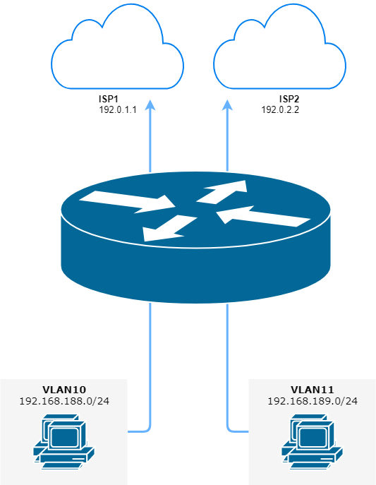

.. include:: ../_include/need_improvement.txt

.. _routing-pbr:

PBR
---

:abbr:`PBR (Policy-Based Routing)` allowing traffic to be assigned to different
routing tables. Traffic can be matched using standard 5-tuple matching (source
address, destination address, protocol, source port, destination port).

Transparent Proxy
^^^^^^^^^^^^^^^^^

The following example will show how VyOS can be used to redirect web traffic to
an external transparent proxy:

.. code-block:: none

  set policy route FILTER-WEB rule 1000 destination port 80
  set policy route FILTER-WEB rule 1000 protocol tcp
  set policy route FILTER-WEB rule 1000 set table 100

This creates a route policy called FILTER-WEB with one rule to set the routing
table for matching traffic (TCP port 80) to table ID 100 instead of the
default routing table.

To create routing table 100 and add a new default gateway to be used by
traffic matching our route policy:

.. code-block:: none

  set protocols static table 100 route 0.0.0.0/0 next-hop 10.255.0.2

This can be confirmed using the show ip route table 100 operational command.

Finally, to apply the policy route to ingress traffic on our LAN interface,
we use:

.. code-block:: none

  set interfaces ethernet eth1 policy route FILTER-WEB

Multiple Uplinks
^^^^^^^^^^^^^^^^

VyOS Policy-Based Routing (PBR) works by matching source IP address ranges and
forwarding the traffic using different routing tables.

Routing tables that will be used in this example are:

* ``table 10`` Routing table used for VLAN 10 (192.168.188.0/24)
* ``table 11`` Routing table used for VLAN 11 (192.168.189.0/24)
* ``main`` Routing table used by VyOS and other interfaces not participating in
  PBR

   Policy-Based Routing with multiple ISP uplinks
   (source ./draw.io/pbr_example_1.drawio)

Add default routes for routing ``table 10`` and ``table 11``

.. code-block:: none

  set protocols static table 10 route 0.0.0.0/0 next-hop 192.0.1.1
  set protocols static table 11 route 0.0.0.0/0 next-hop 192.0.2.2

Add policy route matching VLAN source addresses

.. code-block:: none

  set policy route PBR rule 20 set table '10'
  set policy route PBR rule 20 description 'Route VLAN10 traffic to table 10'
  set policy route PBR rule 20 source address '192.168.188.0/24'

  set policy route PBR rule 30 set table '11'
  set policy route PBR rule 30 description 'Route VLAN11 traffic to table 11'
  set policy route PBR rule 30 source address '192.168.189.0/24'

Apply routing policy to **inbound** direction of out VLAN interfaces

.. code-block:: none

  set interfaces ethernet eth0 vif 10 policy route 'PBR'
  set interfaces ethernet eth0 vif 11 policy route 'PBR'

**OPTIONAL:** Exclude Inter-VLAN traffic (between VLAN10 and VLAN11) from PBR

.. code-block:: none

  set policy route PBR rule 10 description 'VLAN10 <-> VLAN11 shortcut'
  set policy route PBR rule 10 destination address '192.168.188.0/24'
  set policy route PBR rule 10 destination address '192.168.189.0/24'
  set policy route PBR rule 10 set table 'main'

.. note:: Allows the VLAN10 and VLAN20 hosts to communicate with each other
   using the main routing table.
