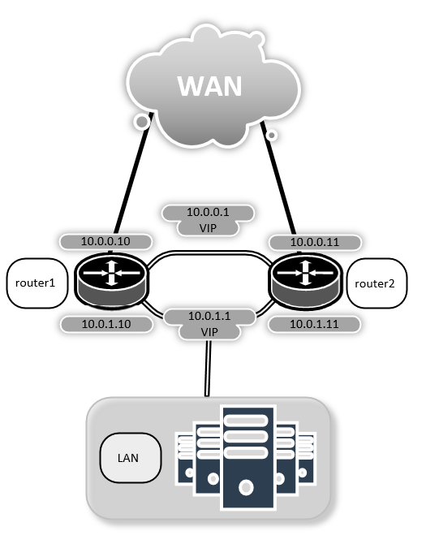
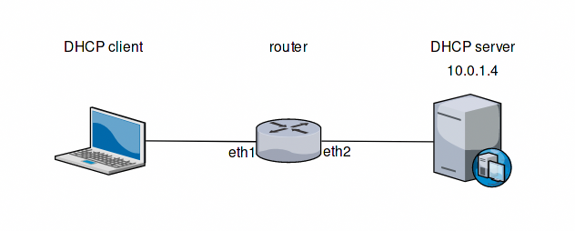
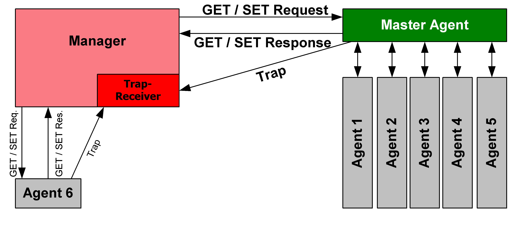

.. _services:

Services
========

This chapter descriptes the available system/network services provided by VyOS.

Conntrack
---------

One of the important features built on top of the Netfilter framework is
connection tracking. Connection tracking allows the kernel to keep track of all
logical network connections or sessions, and thereby relate all of the packets
which may make up that connection. NAT relies on this information to translate
all related packets in the same way, and iptables can use this information to
act as a stateful firewall.

The connection state however is completely independent of any upper-level
state, such as TCP's or SCTP's state. Part of the reason for this is that when
merely forwarding packets, i.e. no local delivery, the TCP engine may not
necessarily be invoked at all. Even connectionless-mode transmissions such as
UDP, IPsec (AH/ESP), GRE and other tunneling protocols have, at least, a pseudo
connection state. The heuristic for such protocols is often based upon a preset
timeout value for inactivity, after whose expiration a Netfilter connection is
dropped.

Each Netfilter connection is uniquely identified by a (layer-3 protocol, source
address, destination address, layer-4 protocol, layer-4 key) tuple. The layer-4
key depends on the transport protocol; for TCP/UDP it is the port numbers, for
tunnels it can be their tunnel ID, but otherwise is just zero, as if it were
not part of the tuple. To be able to inspect the TCP port in all cases, packets
will be mandatorily defragmented.

Configuration
^^^^^^^^^^^^^

.. code-block:: sh

  # Protocols only for which local conntrack entries will be synced (tcp, udp, icmp, sctp)
  set service conntrack-sync accept-protocol

  # Queue size for listening to local conntrack events (in MB)
  set service conntrack-sync event-listen-queue-size <int>

  # Protocol for which expect entries need to be synchronized. (all, ftp, h323, nfs, sip, sqlnet)
  set service conntrack-sync expect-sync

  # Failover mechanism to use for conntrack-sync [REQUIRED]
  set service conntrack-sync failover-mechanism

  set service conntrack-sync cluster group <string>
  set service conntrack-sync vrrp sync-group <1-255>

  # IP addresses for which local conntrack entries will not be synced
  set service conntrack-sync ignore-address ipv4 <x.x.x.x>

  # Interface to use for syncing conntrack entries [REQUIRED]
  set service conntrack-sync interface <ifname>

  # Multicast group to use for syncing conntrack entries
  set service conntrack-sync mcast-group <x.x.x.x>

  # Queue size for syncing conntrack entries (in MB)
  set service conntrack-sync sync-queue-size <size>

Example
^^^^^^^
The next exemple is a simple configuration of conntrack-sync.

   Conntrack Sync Example

First of all, make sure conntrack is enabled by running

.. code-block:: sh

  show conntrack table ipv4

If the table is empty and you have a warning message, it means conntrack is not
enabled. To enable conntrack, just create a NAT or a firewall rule.

.. code-block:: sh

  set firewall state-policy established action accept

You now should have a conntrack table

.. code-block:: sh

  $ show conntrack table ipv4
  TCP state codes: SS - SYN SENT, SR - SYN RECEIVED, ES - ESTABLISHED,
                   FW - FIN WAIT, CW - CLOSE WAIT, LA - LAST ACK,
                   TW - TIME WAIT, CL - CLOSE, LI - LISTEN

  CONN ID    Source                 Destination            Protocol         TIMEOUT
  1015736576 10.35.100.87:58172     172.31.20.12:22        tcp [6] ES       430279
  1006235648 10.35.101.221:57483    172.31.120.21:22       tcp [6] ES       413310
  1006237088 10.100.68.100          172.31.120.21          icmp [1]         29
  1015734848 10.35.100.87:56282     172.31.20.12:22        tcp [6] ES       300
  1015734272 172.31.20.12:60286     239.10.10.14:694       udp [17]         29
  1006239392 10.35.101.221          172.31.120.21          icmp [1]         29

Now configure conntrack-sync service on ``router1`` **and** ``router2``

.. code-block:: sh

  set service conntrack-sync accept-protocol 'tcp,udp,icmp'
  set service conntrack-sync event-listen-queue-size '8'
  set service conntrack-sync failover-mechanism cluster group 'GROUP' # Or VRRP
  set service conntrack-sync interface 'eth0'
  set service conntrack-sync mcast-group '225.0.0.50'
  set service conntrack-sync sync-queue-size '8'

On the active router, you should have informations in the internal-cache of
conntrack-sync. The same current active connections number should be shown in
the external-cache of the standby router

On active router run:

.. code-block:: sh

  $ show conntrack-sync statistics

  Main Table Statistics:

  cache internal:
  current active connections:               10
  connections created:                    8517    failed:            0
  connections updated:                     127    failed:            0
  connections destroyed:                  8507    failed:            0

  cache external:
  current active connections:                0
  connections created:                       0    failed:            0
  connections updated:                       0    failed:            0
  connections destroyed:                     0    failed:            0

  traffic processed:
                     0 Bytes                         0 Pckts

  multicast traffic (active device=eth0):
                868780 Bytes sent               224136 Bytes recv
                 20595 Pckts sent                14034 Pckts recv
                     0 Error send                    0 Error recv

  message tracking:
                     0 Malformed msgs                    0 Lost msgs

  On standby router run:

  $ show conntrack-sync statistics

  Main Table Statistics:

  cache internal:
  current active connections:                0
  connections created:                       0    failed:            0
  connections updated:                       0    failed:            0
  connections destroyed:                     0    failed:            0

  cache external:
  current active connections:               10
  connections created:                     888    failed:            0
  connections updated:                     134    failed:            0
  connections destroyed:                   878    failed:            0

  traffic processed:
                     0 Bytes                         0 Pckts

  multicast traffic (active device=eth0):
                234184 Bytes sent               907504 Bytes recv
                 14663 Pckts sent                21495 Pckts recv
                     0 Error send                    0 Error recv

  message tracking:
                     0 Malformed msgs                    0 Lost msgs

DHCP
----

Multiple DHCP Servers can be run from a single machine. Each DHCP service is
identified by a `shared-network-name`.

DHCP Server Example
^^^^^^^^^^^^^^^^^^^

In this example, we are offering address space in the 172.16.17.0/24 network,
which is on eth1, and pppoe0 is our connection to the internet. We are using
the network name `dhcpexample`.

Prerequisites
^^^^^^^^^^^^^

Configuring the PPPoE interface is assumed to be done already, and appears
on `pppoe0`

Interface Configuration
^^^^^^^^^^^^^^^^^^^^^^^

.. code-block:: sh

 set interface eth1 address 172.16.17.1/24

Multiple ranges can be defined and can contain holes.

.. code-block:: sh

  set service dhcp-server shared-network-name dhcpexample authoritative
  set service dhcp-server shared-network-name dhcpexample subnet 172.16.17.0/24 default-router 172.16.17.1
  set service dhcp-server shared-network-name dhcpexample subnet 172.16.17.0/24 dns-server 172.16.17.1
  set service dhcp-server shared-network-name dhcpexample subnet 172.16.17.0/24 lease 86400
  set service dhcp-server shared-network-name dhcpexample subnet 172.16.17.0/24 range 0 start 172.16.17.100
  set service dhcp-server shared-network-name dhcpexample subnet 172.16.17.0/24 range 0 stop 172.16.17.199

Failover
^^^^^^^^

VyOS provides support for DHCP failover:

.. code-block:: sh

  set service dhcp-server shared-network-name 'LAN' subnet '192.168.0.0/24' failover local-address '192.168.0.1'
  set service dhcp-server shared-network-name 'LAN' subnet '192.168.0.0/24' failover name 'foo'
  set service dhcp-server shared-network-name 'LAN' subnet '192.168.0.0/24' failover peer-address '192.168.0.2'

.. note:: `name` must be identical on both sides!

The primary and secondary statements determines whether the server is primary or secondary

.. code-block:: sh

  set service dhcp-server shared-network-name 'LAN' subnet '192.168.0.0/24' failover status 'primary'

or

.. code-block:: sh

  set service dhcp-server shared-network-name 'LAN' subnet '192.168.0.0/24' failover status 'secondary'

.. note:: In order for the primary and the secondary DHCP server to keep
   their lease tables in sync, they must be able to reach each other on TCP
   port 647. If you have firewall rules in effect, adjust them accordingly.

Static mappings MAC/IP
^^^^^^^^^^^^^^^^^^^^^^

.. code-block:: sh

  set service dhcp-server shared-network-name dhcpexample subnet 172.16.17.0/24 static-mapping static-mapping-01 ip-address 172.16.17.10
  set service dhcp-server shared-network-name dhcpexample subnet 172.16.17.0/24 static-mapping static-mapping-01 mac-address ff:ff:ff:ff:ff:ff

Explanation
^^^^^^^^^^^

* :code:`set service dhcp-server shared-network-name dhcpexample authoritative`

  This says that this device is the only DHCP server for this network. If other
  devices are trying to offer DHCP leases, this machine will send 'DHCPNAK' to
  any device trying to request an IP address that is not valid for this network.

* :code:`set service dhcp-server shared-network-name dhcpexample subnet
  172.16.17.0/24 default-router 172.16.17.1`

  This is a configuration parameter for the subnet, saying that as part of the
  response, tell the client that I am the default router for this network

* :code:`set service dhcp-server shared-network-name dhcpexample subnet
  172.16.17.0/24 dns-server 172.16.17.1`

  This is a configuration parameter for the subnet, saying that as part of the
  response, tell the client that I am the DNS server for this network. If you
  do not want to run a DNS server, you could also provide one of the public
  DNS servers, such as google's. You can add multiple entries by repeating the
  line.

* :code:`set service dhcp-server shared-network-name dhcpexample subnet
  172.16.17.0/24 lease 86400`

  Assign the IP address to this machine for 24 hours. It is unlikely you'd need
  to shorten this period, unless you are running a network with lots of devices
  appearing and disappearing.

* :code:`set service dhcp-server shared-network-name dhcpexample subnet
  172.16.17.0/24 start 172.16.17.100 stop 172.16.17.199`

  Make the IP Addresses between .100 and .199 available for clients.

DHCPv6 server
-------------

VyOS provides DHCPv6 server functionality which is described in this section.
In order to use the DHCPv6 server it has to be enabled first:

.. code-block:: sh

  set service dhcpv6-server

To restart the DHCPv6 server (operational mode):

.. code-block:: sh

  restart dhcpv6 server

To show the current status of the DHCPv6 server use:

.. code-block:: sh

  show dhcpv6 server status

Show statuses of all assigned leases:

.. code-block:: sh

  show dhcpv6 server leases

DHCPv6 server options
^^^^^^^^^^^^^^^^^^^^^

DHCPv6 server preference value
******************************

Clients receiving advertise messages from multiple servers choose the server
with the highest preference value. The range for this value is `0...255`. Set
a preference value for the DHCPv6 server:

.. code-block:: sh

  set service dhcpv6-server preference <preference value>

Delete a preference:

.. code-block:: sh

  set service dhcpv6-server preference

Show current preference:

.. code-block:: sh

  show service dhcpv6-server preference

Specify address lease time
**************************

The default lease time for DHCPv6 leases is 24 hours. This can be changed by
supplying a `default-time`, `maximum-time` and `minimum-time` (all values in
seconds):

.. code-block:: sh

  set service dhcpv6-server shared-network-name <name> subnet <ipv6net> lease-time {default <default-time> | maximum <maximum-time> | minimum <minimum-time>}

Reset the custom lease times:

.. code-block:: sh

  delete service dhcpv6-server shared-network-name <name> subnet <ipv6net> lease-time {default | maximum | minimum}

Show the current configuration:

.. code-block:: sh

  show service dhcpv6-server shared-network-name <name> subnet <ipv6net> lease-time {default | maximum | minimum}

Specify NIS domain
******************

A Network Information (NIS) domain can be set to be used for DHCPv6 clients:

.. code-block:: sh

  set service dhcpv6-server shared-network-name <name> subnet <ipv6net> nis-domain <nis-domain-name>

To Delete the NIS domain:

.. code-block:: sh

  delete service dhcpv6-server shared-network-name <name> subnet <ipv6net> nis-domain <nis-domain-name>

Show a configured NIS domain:

.. code-block:: sh

  show service dhcpv6-server shared-network-name <name> subnet <ipv6net> nis-domain <nis-domain-name>

Specify NIS+ domain
*******************

The procedure to specify a Network Information Service Plus (NIS+) domain is
similar to the NIS domain one:

.. code-block:: sh

  set service dhcpv6-server shared-network-name <name> subnet <ipv6net> nisplus-domain <nisplus-domain-name>

To Delete the NIS+ domain:

.. code-block:: sh

  delete service dhcpv6-server shared-network-name <name> subnet <ipv6net> nisplus-domain <nisplus-domain-name>

Show a configured NIS domain:

 # show service dhcpv6-server shared-network-name <name> subnet <ipv6net> nisplus-domain <nisplus-domain-name>

Specify NIS server address
**************************

To specify a NIS server address for DHCPv6 clients:

.. code-block:: sh

  set service dhcpv6-server shared-network-name <name> subnet <ipv6net> nis-server <IPv6 address>

Delete a specified NIS server address:

.. code-block:: sh

  delete service dhcpv6-server shared-network-name <name> subnet <ipv6net> nis-server <IPv6 address>

Show specified NIS server addresses:

.. code-block:: sh

  show service dhcpv6-server shared-network-name <name> subnet <ipv6net> nis-server

Specify NIS+ server address
***************************

To specify a NIS+ server address for DHCPv6 clients:

.. code-block:: sh

  set service dhcpv6-server shared-network-name <name> subnet <ipv6net> nisplus-server <IPv6 address>

Delete a specified NIS+ server address:

.. code-block:: sh

  delete service dhcpv6-server shared-network-name <name> subnet <ipv6net> nisplus-server <IPv6 address>

Show specified NIS+ server addresses:

.. code-block:: sh

  show service dhcpv6-server shared-network-name <name> subnet <ipv6net> nisplus-server

Specify a SIP server address for DHCPv6 clients
***********************************************

By IPv6 address
###############

A Session Initiation Protocol (SIP) server address can be specified for DHCPv6 clients:

.. code-block:: sh

  set service dhcpv6-server shared-network-name <name> subnet <ipv6net> sip-server-address <IPv6 address>

Delete a specified SIP server address:

.. code-block:: sh

  delete service dhcpv6-server shared-network-name <name> subnet <ipv6net> sip-server-address <IPv6 address>

Show specified SIP server addresses:

.. code-block:: sh

  show service dhcpv6-server shared-network-name <name> subnet <ipv6net> sip-server-address

By FQDN
#######

A name for SIP server can be specified:

.. code-block:: sh

  set service dhcpv6-server shared-network-name <name> subnet <ipv6net> sip-server-name <sip-server-name>

Delete a specified SIP server name:

.. code-block:: sh

  delete service dhcpv6-server shared-network-name <name> subnet <ipv6net> sip-server-name <sip-server-name>

Show specified SIP server names:

.. code-block:: sh

  show service dhcpv6-server shared-network-name <name> subnet <ipv6net> sip-server-name

Simple Network Time Protocol (SNTP) server address for DHCPv6 clients
*********************************************************************

A SNTP server address can be specified for DHCPv6 clients:

.. code-block:: sh

  set service dhcpv6-server shared-network-name <name> subnet <ipv6net> sntp-server-address <IPv6 address>

Delete a specified SNTP server address:

.. code-block:: sh

  delete service dhcpv6-server shared-network-name <name> subnet <ipv6net> sntp-server-address <IPv6 address>

Show specified SNTP server addresses:

.. code-block:: sh

  show service dhcpv6-server shared-network-name <name> subnet <ipv6net> sntp-server-address

DHCPv6 address pools
^^^^^^^^^^^^^^^^^^^^

DHCPv6 address pools must be configured for the system to act as a DHCPv6
server. The following example describes a common scenario.

Example 1: DHCPv6 address pool
******************************

A shared network named `NET1` serves subnet `2001:db8:100::/64` which is
connected to `eth1`, a DNS server at `2001:db8:111::111` is used for name
services. The range of the address pool shall be `::100` through `::199`. The
lease time will be left at the default value which is 24 hours.

.. code-block:: sh

  set service dhcpv6-server shared-network-name NET1 subnet 2001:db8:100::/64 address-range start 2001:db8:100::100 stop 2001:db8:100::199
  set service dhcpv6-server shared-network-name NET1 subnet 2001:db8:100::/64 name-server 2001:db8:111::111

Commit the changes and show the configuration:

.. code-block:: sh

  commit
  show service dhcpv6-server
      shared-network-name NET1 {
          subnet 2001:db8:100::/64 {
             address-range {
                start 2001:db8:100::100 {
                   stop 2001:db8:100::199
                }
             }
             name-server 2001:db8:111::111
          }
      }

Static mappings
^^^^^^^^^^^^^^^

In order to map specific IPv6 addresses to specific hosts static mappings can
be created. The following example explains the process.

Example 1: Static IPv6 MAC-based mapping
****************************************

IPv6 address `2001:db8:100::101` shall be statically mapped to a device with
MAC address `00:15:c5:b7:5e:23`, this host-specific mapping shall be named
`client1`.

.. note:: The MAC address identifier is defined by the last 4 byte of the
   MAC address.

.. code-block:: sh

  set service dhcpv6-server shared-network-name NET1 subnet 2001:db8:100::/64 static-mapping client1 ipv6-address 2001:db8:100::101
  set service dhcpv6-server shared-network-name NET1 subnet 2001:db8:100::/64 static-mapping client1 identifier c5b75e23

Commit the changes and show the configuration:

.. code-block:: sh

  show service dhcp-server shared-network-name NET1
     shared-network-name NET1 {
         subnet 2001:db8:100::/64 {
            name-server 2001:db8:111::111
            address-range {
                start 2001:db8:100::100 {
                   stop 2001:db8:100::199 {
                }
            }
            static-mapping client1 {
               ipv6-address 2001:db8:100::101
               identifier c5b75e23
            }
         }
      }

DHCP Relay
----------

If you want your router to forward DHCP requests to an external DHCP server
you can configure the system to act as a DHCP relay agent. The DHCP relay
agent works with IPv4 and IPv6 addresses.

All interfaces used for the DHCP relay must be configured. See
https://wiki.vyos.net/wiki/Network_address_setup.

DHCP relay example
^^^^^^^^^^^^^^^^^^

   DHCP relay example

In this example the interfaces used for the DHCP relay are eth1 and eth2. The
router receives DHCP client requests on eth1 and relays them through eth2 to
the DHCP server at 10.0.1.4.

Configuration
^^^^^^^^^^^^^

Enable DHCP relay for eth1 and eth2:

.. code-block:: sh

  set service dhcp-relay interface eth1
  set service dhcp-relay interface eth2

Set the IP address of the DHCP server:

.. code-block:: sh

  set service dhcp-relay server 10.0.1.4

The router should discard DHCP packages already containing relay agent
information to ensure that only requests from DHCP clients are forwarded:

.. code-block:: sh

  set service dhcp-relay relay-options relay-agents-packets discard

Commit the changes and show the results:

.. code-block:: sh

  commit
  show service dhcp-relay
      interface eth1
      interface eth2
      server 10.0.1.4
      relay-options {
         relay-agents-packets discard
      }

The DHCP relay agent can be restarted with:

.. code-block:: sh

  restart dhcp relay-agent

DHCPv6 relay example
^^^^^^^^^^^^^^^^^^^^

.. figure:: _static/images/service_dhcpv6-relay01.png
   :scale: 80 %
   :alt: DHCPv6 relay example

   DHCPv6 relay example

In this example DHCPv6 requests are received by the router on eth1 (`listening
interface`) and forwarded through eth2 (`upstream interface`) to the external
DHCPv6 server at 2001:db8:100::4.

Configuration
*************

Set eth1 to be the listening interface for the DHCPv6 relay:

.. code-block:: sh

  set service dhcpv6-relay listen-interface eth1

Set eth2 to be the upstream interface and specify the IPv6 address of the DHCPv6 server:

.. code-block:: sh

  set service dhcpv6-relay upstream-interface eth2 address 2001:db8:100::4

Commit the changes and show results:

.. code-block:: sh

  commit
  show service dhcpv6-relay
      listen-interface eth1 {
      }
      upstream-interface eth2 {
         address 2001:db8:100::4
      }

Show the current status of the DHCPv6 relay agent:

.. code-block:: sh

  show dhcpv6 relay-agent status

The DHCPv6 relay agent can be restarted with:

.. code-block:: sh

  restart dhcpv6 relay-agent

Additional parameters
^^^^^^^^^^^^^^^^^^^^^

DHCP relay agent options
************************

Set the maximum hop count before packets are discarded. Range 0...255,
default 10.

* :code:`set service dhcp-relay relay-options hop-count 'count'`

Set maximum size of DHCP packets including relay agent information. If a
DHCP packet size surpasses this value it will be forwarded without appending
relay agent information. Range 64...1400, default 576.

* :code:`set service dhcp-relay relay-options max-size 'size'`

Four policies for reforwarding DHCP packets exist:

* **append:** The relay agent is allowed to append its own relay information
  to a received DHCP packet, disregarding relay information already present in
  the packet.

* **discard:** Received packets which already contain relay information will
  be discarded.

* **forward:** All packets are forwarded, relay information already present
  will be ignored.

* **replace:** Relay information already present in a packet is stripped and
  replaced with the router's own relay information set.

* :code:`set service dhcp-relay relay-options relay-agents-packet 'policy'`

DHCPv6 relay agent options
**************************

Set maximum hop count before packets are discarded. Default: 10.

* :code:`set service dhcpv6-relay max-hop-count 'count'`

If this is set the relay agent will insert the interface ID. This option is
set automatically if more than one listening interfaces are in use.

* :code:`set service dhcpv6-relay use-interface-id-option`

DNS Forwarding
--------------

Use DNS forwarding if you want your router to function as a DNS server for the
local network. There are several options, the easiest being 'forward all
traffic to the system DNS server(s)' (defined with set system name-server):

.. code-block:: sh

  set service dns forwarding system

Manually setting DNS servers for forwarding:

.. code-block:: sh

  set service dns forwarding name-server 8.8.8.8
  set service dns forwarding name-server 8.8.4.4

Manually setting DNS servers with IPv6 connectivity:

.. code-block:: sh

  set service dns forwarding name-server 2001:4860:4860::8888
  set service dns forwarding name-server 2001:4860:4860::8844

Setting a forwarding DNS server for a specific domain:

.. code-block:: sh

  set service dns forwarding domain example.com server 192.0.2.1

Example 1
^^^^^^^^^

Router with two interfaces eth0 (WAN link) and eth1 (LAN). A DNS server for the
local domain (example.com) is at 192.0.2.1, other DNS requests are forwarded
to Google's DNS servers.

.. code-block:: sh

  set service dns forwarding domain example.com server 192.0.2.1
  set service dns forwarding name-server 8.8.8.8
  set service dns forwarding name-server 8.8.4.4
  set service dns forwarding listen-on 'eth1'

Example 2
^^^^^^^^^

Same as example 1 but with additional IPv6 addresses for Google's public DNS
servers:

.. code-block:: sh

  set service dns forwarding domain example.com server 192.0.2.1
  set service dns forwarding name-server 8.8.8.8
  set service dns forwarding name-server 8.8.4.4
  set service dns forwarding name-server 2001:4860:4860::8888
  set service dns forwarding name-server 2001:4860:4860::8844
  set service dns forwarding listen-on 'eth1'

Dynamic DNS
-----------

VyOS is able to update a remote DNS record when an interface gets a new IP
address. In order to do so, VyOS includes ddclient_, a perl script written for
this exact purpose.

ddclient_ uses two methods to update a DNS record. The first one will send
updates directly to the DNS daemon, in compliance with RFC2136_. The second
one involves a third party service, like DynDNS.com or any other similar
website. This method uses HTTP requests to transmit the new IP address. You
can configure both in VyOS.

VyOS CLI and RFC2136
^^^^^^^^^^^^^^^^^^^^

First, create an RFC2136_ config node :

.. code-block:: sh

  edit service dns dynamic interface eth0 rfc2136 <confignodename>

Present your RNDC key to ddclient :

.. code-block:: sh

  set key /config/dyndns/mydnsserver.rndc.key

Set the DNS server IP/FQDN :

.. code-block:: sh

  set server dns.mydomain.com

Set the NS zone to be updated :

.. code-block:: sh

  set zone mydomain.com

Set the records to be updated :

.. code-block:: sh

  set record dyn
  set record dyn2

You can optionally set a TTL (note : default value is 600 seconds) :

.. code-block:: sh

  set ttl 600

This will generate the following ddclient config blocks:

.. code-block:: sh

  server=dns.mydomain.com
  protocol=nsupdate
  password=/config/dyndns/mydnsserver.rndc.key
  ttl=600
  zone=mydomain.com
  dyn
  server=dns.mydomain.com
  protocol=nsupdate
  password=/config/dyndns/mydnsserver.rndc.key
  ttl=600
  zone=mydomain.com
  dyn2

You can also keep a different dns zone updated. Just create a new config node:

.. code-block:: sh

  edit service dns dynamic interface eth0 rfc2136 <confignode2>

VyOS CLI and HTTP dynamic DNS services
^^^^^^^^^^^^^^^^^^^^^^^^^^^^^^^^^^^^^^

VyOS is also able to use any service relying on protocols supported by ddclient.

To use such a service, you must define a login, a password, one or multiple
hostnames, a protocol and a server.

.. code-block:: sh

  edit service dns dynamic interface eth0 service HeNet
  set login my-login # set password my-password
  set host-name my-tunnel-id
  set protocol dyndns2
  set server ipv4.tunnelbroker.net

VyOS is also shipped with a list of known services. You don't need to set the
protocol and server value as VyOS has defaults provided for those. These are
the services VyOS knows about:

* afraid
* changeip
* dnspark
* dslreports
* dyndns
* easydns
* namecheap
* noip
* zoneedit

To use DynDNS for example:

.. code-block:: sh

  edit service dns dynamic interface eth0 service dyndns
  set login my-login
  set password my-password
  set host-name my-dyndns-hostname

It's possible to use multiple services :

.. code-block:: sh

  edit service dns dynamic interface eth0 service dyndns
  set login my-login
  set password my-password
  set host-name my-dyndns-hostname
  edit service dns dynamic interface eth0 service HeNet
  set login my-login
  set password my-password
  set host-name my-tunnel-id
  set protocol dyndns2
  set server ipv4.tunnelbroker.net

ddclient behind NAT
^^^^^^^^^^^^^^^^^^^

By default, ddclient will update a dynamic dns record using the IP address
directly attached to the interface. If your VyOS instance is behind NAT, your
record will be updated to point to your internal IP.

ddclient_ has another way to determine the WAN IP address. This is controlled
by these two options:

.. code-block:: sh

  set service dns dynamic interface eth0 use-web url
  set service dns dynamic interface eth0 use-web skip

ddclient_ will load the webpage at `[url]` and will try to extract an IP
address for the response. ddclient_ will skip any address located before the
string set in `[skip]`.

LLDP
----

The Link Layer Discovery Protocol (LLDP) is a vendor-neutral link layer protocol
in the Internet Protocol Suite used by network devices for advertising their
identity, capabilities, and neighbors on an IEEE 802 local area network,
principally wired Ethernet.[1] The protocol is formally referred to by the IEEE
as Station and Media Access Control Connectivity Discovery specified in
IEEE 802.1AB and IEEE 802.3-2012 section 6 clause 79.

LLDP performs functions similar to several proprietary protocols, such as `Cisco
Discovery Protocol`_, `Foundry Discovery Protocol`_, Nortel Discovery Protocol
and Link Layer Topology Discovery.

Information gathered
^^^^^^^^^^^^^^^^^^^^

Information gathered with LLDP is stored in the device as a management
information database (MIB_) and can be queried with the Simple Network
Management Protocol (SNMP_) as specified in RFC 2922. The topology of an
LLDP-enabled network can be discovered by crawling the hosts and querying this
database. Information that may be retrieved include:

* System name and description
* Port name and description
* VLAN name
* IP management address
* System capabilities (switching, routing, etc.)
* MAC/PHY information
* MDI power
* Link aggregation

Configuration
^^^^^^^^^^^^^

* Enable service with:

  :code:`set service lldp`

Options
*******

* Configure a Define management-address:

  :code:`set service lldp management-address <x.x.x.x>`

* Define listening interfaces

  :code:`set service lldp interface <all|interface name>`

* LLDPd also implements an SNMP subagent. To Enable SNMP queries of the LLDP
  database:

  :code:`set service lldp snmp enable`

* Enable optional/other protocols

  :code:`set service lldp legacy-protocols cdp`

  Supported legacy protocols:

 * ``cdp`` - Listen for CDP for Cisco routers/switches
 * ``edp`` - Listen for EDP for Extreme routers/switches
 * ``fdp`` - Listen for FDP for Foundry routers/switches
 * ``sonmp`` - Listen for SONMP for Nortel routers/switches

Display neighbors
^^^^^^^^^^^^^^^^^

* Display with:

``show lldp neighbors``

Exemple:

.. code-block:: sh

  vyos@vyos:~# show lldp neighbors
  Capability Codes: R - Router, B - Bridge, W - Wlan r - Repeater, S - Station
                   D - Docsis, T - Telephone, O - Other
  Device ID                 Local  Proto  Cap   Platform             Port ID
  ---------                 -----  -----  ---   --------             -------
  swA309                    eth0   LLDP   ?     Cisco IOS Software,  GigE0/33

* Options:

 * ``detail`` - Show lldp neighbors detail
 * ``interface`` - Show LLDP for specified interface

Troubleshooting
^^^^^^^^^^^^^^^

Use operationnal command ``show log lldp`` to display logs.

mDNS Repeater
-------------

Starting with VyOS 1.2 a `Multicast DNS`_ (mDNS) repeater functionality is
provided.

Multicast DNS uses the 224.0.0.51 address, which is "administratively scoped"
and does not leave the subnet. It re-broadcast mDNS packets from one interface
to other interfaces. This enables support for e.g. Apple Airplay devices across
multiple VLANs.

To enable mDNS repeater you need to configure at least two interfaces. To re-
broadcast all mDNS packets from `eth0` to `eth1` and vice versa run:

.. code-block:: sh

  set service mdns repeater interface eth0
  set service mdns repeater interface eth1

mDNS repeater can be temporarily disabled without deleting the service using

.. code-block:: sh

  set service mdns repeater disable

.. note:: You can not run this in a VRRP setup, if multiple mDNS repeaters
   are launched in a subnet you will experience the mDNS packet storm death!

UDP broadcast relay
-------------------

Certain vendors use broadcasts to identify their equipemnt within one ethernet
segment. Unfortunately if you split your network with multiple VLANs you loose
the ability of identifying your equiment.

This is where "UDP broadcast relay" comes into play! It will forward received
broadcasts to other configured networks.

Every UDP port which will be forward requires one unique ID. Currently we
support 99 IDs!

Example #1: To forward all broadcast packets received on `UDP port 1900` on
`eth3`, `eth4` or `eth5` to all other interfaces in this configuration.

.. code-block:: sh

  set service broadcast-relay id 1 description 'SONOS'
  set service broadcast-relay id 1 interface 'eth3'
  set service broadcast-relay id 1 interface 'eth4'
  set service broadcast-relay id 1 interface 'eth5'
  set service broadcast-relay id 1 port '1900'

Example #2: To Forward all broadcasts packets received on `UDP port 6969` on
`eth3` or `eth4` to the other interface in this configuration.

.. code-block:: sh

  set service broadcast-relay id 2 description 'SONOS MGMT'
  set service broadcast-relay id 2 interface 'eth3'
  set service broadcast-relay id 2 interface 'eth4'
  set service broadcast-relay id 2 port '6969'

Disable Instance(s)
^^^^^^^^^^^^^^^^^^^

Each broadcast relay instance can be individually disabled without deleting the
configured node by using the following command:

.. code-block:: sh

  set service broadcast-relay id <n> disable

In addition you can also disable the whole service without removing the
configuration by:

.. code-block:: sh

  set service broadcast-relay disable

.. note:: You can run the UDP broadcast relay service on multiple routers
   connected to a subnet. There is **NO** UDP broadcast relay packet storm!

SNMP
----

Simple Network Management Protocol (SNMP_) is an Internet Standard protocol
for collecting and organizing information about managed devices on IP networks
and for modifying that information to change device behavior. Devices that
typically support SNMP include cable modems, routers, switches, servers,
workstations, printers, and more.

SNMP is widely used in network management for network monitoring. SNMP exposes
management data in the form of variables on the managed systems organized in
a management information base (MIB_) which describe the system status and
configuration. These variables can then be remotely queried (and, in some
circumstances, manipulated) by managing applications.

Three significant versions of SNMP have been developed and deployed. SNMPv1 is
the original version of the protocol. More recent versions, SNMPv2c and SNMPv3,
feature improvements in performance, flexibility and security.

SNMP is a component of the Internet Protocol Suite as defined by the Internet
Engineering Task Force (IETF). It consists of a set of standards for network
management, including an application layer protocol, a database schema, and a
set of data objects.

Overview and basic concepts
^^^^^^^^^^^^^^^^^^^^^^^^^^^

In typical uses of SNMP, one or more administrative computers called managers
have the task of monitoring or managing a group of hosts or devices on a
computer network. Each managed system executes a software component called an
agent which reports information via SNMP to the manager.

An SNMP-managed network consists of three key components:

* Managed devices

* Agent – software which runs on managed devices

* Network management station (NMS) – software which runs on the manager

A managed device is a network node that implements an SNMP interface that
allows unidirectional (read-only) or bidirectional (read and write) access to
node-specific information. Managed devices exchange node-specific information
with the NMSs. Sometimes called network elements, the managed devices can be
any type of device, including, but not limited to, routers, access servers,
switches, cable modems, bridges, hubs, IP telephones, IP video cameras,
computer hosts, and printers.

An agent is a network-management software module that resides on a managed
device. An agent has local knowledge of management information and translates
that information to or from an SNMP-specific form.

A network management station executes applications that monitor and control
managed devices. NMSs provide the bulk of the processing and memory resources
required for network management. One or more NMSs may exist on any managed
network.

   Image thankfully borrowed from https://en.wikipedia.org/wiki/File:SNMP_communication_principles_diagram.PNG
   which is under the GNU Free Documentation License

.. note:: VyOS SNMP supports both IPv4 and IPv6.

SNMP protocol versions
^^^^^^^^^^^^^^^^^^^^^^

VyOS itself supports SNMPv2_ (version 2) and SNMPv3_ (version 3) where the
later is recommended because of improved security (optional authentication and
encryption).

SNMPv2
^^^^^^

SNMPv2 is the original and most commonly used version. For authorizing clients,
SNMP uses the concept of communities. Communities may have authorization set
to read only (this is most common) or to read and write (this option is not
actively used in VyOS).

SNMP can work synchronously or asynchronously. In synchronous communication,
the monitoring system queries the router periodically. In asynchronous, the
router sends notification to the "trap" (the monitoring host).

SNMPv2 does not support any authentication mechanisms, other than client source
address, so you should specify addresses of clients allowed to monitor the
router. Note that SNMPv2 also supports no encryption and always sends data in
plain text.

Example
*******

.. code-block:: sh

  # Define a community
  set service snmp community routers authorization ro

  # Allow monitoring access from the entire network
  set service snmp community routers network 192.0.2.0/24
  set service snmp community routers network 2001::db8:ffff:eeee::/64

  # Allow monitoring access from specific addresses
  set service snmp community routers client 203.0.113.10
  set service snmp community routers client 203.0.113.20

  # Define optional router information
  set service snmp location "UK, London"
  set service snmp contact "admin@example.com"

  # Trap target if you want asynchronous communication
  set service snmp trap-target 203.0.113.10

  # Listen only on specific IP addresses (port defaults to 161)
  set service snmp listen-address 172.16.254.36 port 161
  set service snmp listen-address 2001:db8::f00::1

SNMPv3
^^^^^^

SNMPv3 is an updated version that, among other things, supports encryption and
cryptographic authentication of clients.

Example
*******

.. code-block:: sh

  set service snmp v3 engineid '0x0aa0d6c6f450'
  set service snmp v3 group defaultgroup mode 'ro'
  set service snmp v3 group defaultgroup seclevel 'priv'
  set service snmp v3 group defaultgroup view 'defaultview'
  set service snmp v3 view defaultview oid '1'

  set service snmp v3 user testUser1 auth plaintext-key testUserKey1
  set service snmp v3 user testUser1 auth type 'md5'
  set service snmp v3 user testUser1 engineid '0x0aa0d6c6f450'
  set service snmp v3 user testUser1 group 'defaultgroup'
  set service snmp v3 user testUser1 mode 'ro'
  set service snmp v3 user testUser1 privacy type aes
  set service snmp v3 user testUser1 privacy plaintext-key testUserKey1

After commit the resulting configuration will look like:

.. note:: SNMPv3 keys won't we stored in plaintext. On ``commit`` the keys will
   be encrypted and the encrypted key is based on the engineid!

.. code-block:: sh

  vyos@vyos# show service snmp
   v3 {
       engineid 0x0aa0d6c6f450
       group defaultgroup {
           mode ro
           seclevel priv
           view defaultview
       }
       user testUser1 {
           auth {
               encrypted-key 0x3b68d4162c2c817b8e9dfb6f08583e5d
               type md5
           }
           engineid 0x0aa0d6c6f450
           group defaultgroup
           mode ro
           privacy {
               encrypted-key 0x3b68d4162c2c817b8e9dfb6f08583e5d
               type aes
           }
       }
       view defaultview {
           oid 1 {
           }
       }
   }

SSH
---

Secure Shell (SSH_) is a cryptographic network protocol for operating network
services securely over an unsecured network.[1] The standard TCP port for SSH
is 22. The best known example application is for remote login to computer
systems by users.

SSH provides a secure channel over an unsecured network in a client-server
architecture, connecting an SSH client application with an SSH server. Common
applications include remote command-line login and remote command execution,
but any network service can be secured with SSH. The protocol specification
distinguishes between two major versions, referred to as SSH-1 and SSH-2.

The most visible application of the protocol is for access to shell accounts
on Unix-like operating systems, but it sees some limited use on Windows as
well. In 2015, Microsoft announced that they would include native support for
SSH in a future release.

SSH was designed as a replacement for Telnet and for unsecured remote shell
protocols such as the Berkeley rlogin, rsh, and rexec protocols. Those protocols
send information, notably passwords, in plaintext, rendering them susceptible
to interception and disclosure using packet analysis. The encryption used by
SSH is intended to provide confidentiality and integrity of data over an
unsecured network, such as the Internet.

Configuration
^^^^^^^^^^^^^

Enabling SSH only requires you to add ``service ssh port NN``, where 'NN' is
the port you want SSH to listen on. By default, SSH runs on port 22.

.. code-block:: sh

  set service ssh port 22

Options
*******

* Listening address - Specify the IPv4/IPv6 listening address for connection
  requests. Multiple ``listen-address`` nodes can be defined.

  :code:`set service ssh listen-address <address>`

* Allow ``root`` login, this can be set to allow ``root`` logins on SSH
  connections, however it is not advisable to use this setting as this bears
  serious security risks. The default system user posesses all required
  privileges.

  :code:`set service ssh allow-root`

* Allowed ciphers - A number of allowed ciphers can be specified, use multiple
  occurances to allow multiple ciphers.

  :code:`set service ssh ciphers <cipher>`

  Available ciphers:

 * `3des-cbc`
 * `aes128-cbc`
 * `aes192-cbc`
 * `aes256-cbc`
 * `aes128-ctr`
 * `aes192-ctr`
 * `aes256-ctr`
 * `arcfour128`
 * `arcfour256`
 * `arcfour`
 * `blowfish-cbc`
 * `cast128-cbc`

* Disable password authentication - If SSH key authentication is set up,
  password-based user authetication can be disabled. This hardens security!

  :code:`set service ssh disable-password-authentication`

* Disable host validation - Disable the host validation through reverse DNS
  lookups.

  :code:`set service ssh disable-host-validation`

* MAC algorithms - Specifies the available MAC (message authentication code)
  algorithms. The MAC algorithm is used in protocol version 2 for data
  integrity protection. Multiple algorithms can be entered.

  :code:`set service ssh macs <macs>`

  Supported MACs:

 * `hmac-md5`
 * `hmac-md5-96`
 * `hmac-ripemd160`
 * `hmac-sha1`
 * `hmac-sha1-96`
 * `hmac-sha2-256`
 * `hmac-sha2-512`
 * `umac-64@openssh.com`
 * `umac-128@openssh.com`
 * `hmac-md5-etm@openssh.com`
 * `hmac-md5-96-etm@openssh.com`
 * `hmac-ripemd160-etm@openssh.com`
 * `hmac-sha1-etm@openssh.com`
 * `hmac-sha1-96-etm@openssh.com`
 * `hmac-sha2-256-etm@openssh.com`
 * `hmac-sha2-512-etm@openssh.com`
 * `umac-64-etm@openssh.com`
 * `umac-128-etm@openssh.com`

Key Authentication
##################

It is highly recommended to use SSH Key authentication. By default there is
only one user (``vyos``), and you can assign any number of keys to that user.
You can generate a ssh key with the ``ssh-keygen`` command on your local
machine, which will (by default) save it as ``~/.ssh/id_rsa.pub`` which is in
three parts:

 ``ssh-rsa AAAAB3NzaC1yc2EAAAADAQABAA...VByBD5lKwEWB username@host.example.com``

Only the type (``ssh-rsa``) and the key (``AAAB3N...``) are used. Note that
the key will usually be several hundred characters long, and you will need to
copy and paste it. Some terminal emulators may accidentally split this over
several lines. Be attentive when you paste it that it only pastes as a single
line. The third part is simply an identifier, and is for your own reference.

**Assign SSH Key to user**

Under the user (in this example, ``vyos``), add the public key and the type.
The `identifier` is simply a string that is relevant to you.

.. code-block:: sh

  set system login user vyos authentication public-keys 'identifier' key "AAAAB3Nz...."
  set system login user vyos authentication public-keys 'identifier' type ssh-rsa"

You can assign multiple keys to the same user by changing the identifier. In
the following example, both Unicron and xrobau will be able to SSH into VyOS
as the ``vyos`` user using their own keys.

.. code-block:: sh

  set system login user vyos authentication public-keys 'Unicron' key "AAAAB3Nz...."
  set system login user vyos authentication public-keys 'Unicron' type ssh-rsa
  set system login user vyos authentication public-keys 'xrobau' key "AAAAQ39x...."
  set system login user vyos authentication public-keys 'xrobau' type ssh-rsa

TFTP
----

Trivial File Transfer Protocol (TFTP_) is a simple lockstep File Transfer
Protocol which allows a client to get a file from or put a file onto a remote
host. One of its primary uses is in the early stages of nodes booting from a
local area network. TFTP has been used for this application because it is very
simple to implement.

Example
^^^^^^^

.. code-block:: sh

  # If you want to enable uploads, else TFTP server will act as read-only (optional)
  set service tftp-server allow-upload

  # Directory for TFTP server content
  set service tftp-server directory '/config/tftpboot'

  # On which addresses we want to listen for incoming TFTP connections? (mandatory)
  set service tftp-server listen-address '2001:db8:ffee::1'
  set service tftp-server listen-address '10.10.1.1'

.. note:: Choose your ``directory`` location carefully or you will loose the
   content on image upgrades. Any directory under ``/config`` is save at this
   will be migrated.

.. note:: Configuring a listen-address is essential for the service to work.

The resulting configuration will look like:

.. code-block:: sh

  vyos@vyos# show service
   tftp-server {
      allow-upload
      directory /config/tftpboot
      listen-address 2001:db8:ffee::1
      listen-address 10.10.1.1
   }

Webproxy
--------

The proxy service in VyOS is based on Squid3 and some related modules.

Squid is a caching and forwarding HTTP web proxy. It has a wide variety of uses,
including speeding up a web server by caching repeated requests, caching web,
DNS and other computer network lookups for a group of people sharing network
resources, and aiding security by filtering traffic. Although primarily used
for HTTP and FTP, Squid includes limited support for several other protocols
including Internet Gopher, SSL,[6] TLS and HTTPS. Squid does not support the
SOCKS protocol.

All examples here assumes that your inside ip address is ``192.168.0.1``.
Replace with your own where applicable.

URL Filtering is provided by Squidguard_.

Configuration
^^^^^^^^^^^^^^

.. code-block:: sh

  # Enable proxy service
  set service webproxy listen-address 192.168.0.1

  # By default it will listen to port 3128. If you wan't something else you have to define that.
  set service webproxy listen-address 192.168.0.1 port 2050

  # By default the transparent proxy on that interface is enabled. To disable that you simply
  set service webproxy listen-address 192.168.0.1 disable-transparent

  # Block specific urls
  set service webproxy url-filtering squidguard local-block myspace.com

  # If you want to you can log these blocks
  set service webproxy url-filtering squidguard log local-block

Options
*******

Filtering by category
^^^^^^^^^^^^^^^^^^^^^

If you wan't to use existing blacklists you have to create/download a database
first. Otherwise you will not be able to commit the config changes.

.. code-block:: sh

  vyos@vyos# commit
  [ service webproxy ]
  Warning: no blacklists installed
  Unknown block-category [ads] for policy [default]

  [[service webproxy]] failed
  Commit failed

* Download/Update complete blacklist

  :code:`update webproxy blacklists`

* Download/Update partial blacklist

  :code:`update webproxy blacklists category ads`

  Use tab completion to get a list of categories.

* To auto update the blacklist files

  :code:`set service webproxy url-filtering squidguard auto-update update-hour 23`

* To configure blocking add the following to the configuration

  :code:`set service webproxy url-filtering squidguard block-category ads`

  :code:`set service webproxy url-filtering squidguard block-category malware`

Authentication
^^^^^^^^^^^^^^

TBD: https://wiki.vyos.net/wiki/Web_proxy_LDAP_authentication

Adjusting cache size
^^^^^^^^^^^^^^^^^^^^

The size of the proxy cache can be adjusted by the user.

.. code-block:: sh

  set service webproxy cache-size
   Possible completions:
     <0-4294967295>
                  Disk cache size in MB (default 100)
     0            Disable disk caching
     100

.. _ddclient: http://sourceforge.net/p/ddclient/wiki/Home/
.. _RFC2136: https://www.ietf.org/rfc/rfc2136.txt
.. _`Cisco Discovery Protocol`: https://en.wikipedia.org/wiki/Cisco_Discovery_Protocol
.. _`Foundry Discovery Protocol`: https://en.wikipedia.org/wiki/Foundry_Discovery_Protocol
.. _`Multicast DNS`: https://en.wikipedia.org/wiki/Multicast_DNS
.. _SSH: https://en.wikipedia.org/wiki/Secure_Shell
.. _SNMP: https://en.wikipedia.org/wiki/Simple_Network_Management_Protocol
.. _SNMPv2: https://en.wikipedia.org/wiki/Simple_Network_Management_Protocol#Version_2
.. _SNMPv3: https://en.wikipedia.org/wiki/Simple_Network_Management_Protocol#Version_3
.. _MIB: https://en.wikipedia.org/wiki/Management_information_base
.. _TFTP: https://en.wikipedia.org/wiki/Trivial_File_Transfer_Protocol
.. _Squid3: http://www.squid-cache.org/
.. _Squidguard: http://www.squidguard.org/
