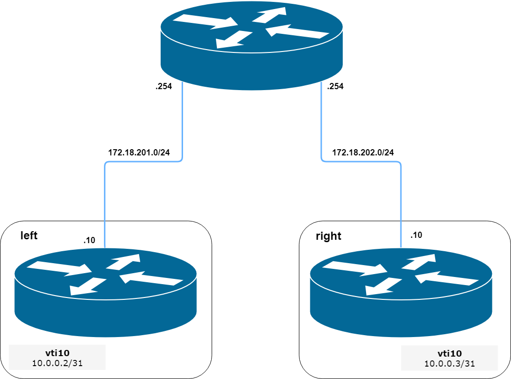

.. _size2site_ipsec:

Site-to-Site
------------

IKEv1
^^^^^

Example:

* WAN interface on `eth1`
* left subnet: `192.168.0.0/24` site1, server side (i.e. locality, actually
  there is no client or server roles)
* left local_ip: `1.1.1.1` # server side WAN IP
* right subnet: `10.0.0.0/24` site2,remote office side
* right local_ip: `2.2.2.2` # remote office side WAN IP

.. code-block:: sh

  # server config
  set vpn ipsec esp-group office-srv-esp compression 'disable'
  set vpn ipsec esp-group office-srv-esp lifetime '1800'
  set vpn ipsec esp-group office-srv-esp mode 'tunnel'
  set vpn ipsec esp-group office-srv-esp pfs 'enable'
  set vpn ipsec esp-group office-srv-esp proposal 1 encryption 'aes256'
  set vpn ipsec esp-group office-srv-esp proposal 1 hash 'sha1'
  set vpn ipsec ike-group office-srv-ike ikev2-reauth 'no'
  set vpn ipsec ike-group office-srv-ike key-exchange 'ikev1'
  set vpn ipsec ike-group office-srv-ike lifetime '3600'
  set vpn ipsec ike-group office-srv-ike proposal 1 encryption 'aes256'
  set vpn ipsec ike-group office-srv-ike proposal 1 hash 'sha1'
  set vpn ipsec ipsec-interfaces interface 'eth1'
  set vpn ipsec site-to-site peer 2.2.2.2 authentication mode 'pre-shared-secret'
  set vpn ipsec site-to-site peer 2.2.2.2 authentication pre-shared-secret 'SomePreSharedKey'
  set vpn ipsec site-to-site peer 2.2.2.2 ike-group 'office-srv-ike'
  set vpn ipsec site-to-site peer 2.2.2.2 local-address '1.1.1.1'
  set vpn ipsec site-to-site peer 2.2.2.2 tunnel 0 allow-nat-networks 'disable'
  set vpn ipsec site-to-site peer 2.2.2.2 tunnel 0 allow-public-networks 'disable'
  set vpn ipsec site-to-site peer 2.2.2.2 tunnel 0 esp-group 'office-srv-esp'
  set vpn ipsec site-to-site peer 2.2.2.2 tunnel 0 local prefix '192.168.0.0/24'
  set vpn ipsec site-to-site peer 2.2.2.2 tunnel 0 remote prefix '10.0.0.0/21'

  # remote office config
  set vpn ipsec esp-group office-srv-esp compression 'disable'
  set vpn ipsec esp-group office-srv-esp lifetime '1800'
  set vpn ipsec esp-group office-srv-esp mode 'tunnel'
  set vpn ipsec esp-group office-srv-esp pfs 'enable'
  set vpn ipsec esp-group office-srv-esp proposal 1 encryption 'aes256'
  set vpn ipsec esp-group office-srv-esp proposal 1 hash 'sha1'
  set vpn ipsec ike-group office-srv-ike ikev2-reauth 'no'
  set vpn ipsec ike-group office-srv-ike key-exchange 'ikev1'
  set vpn ipsec ike-group office-srv-ike lifetime '3600'
  set vpn ipsec ike-group office-srv-ike proposal 1 encryption 'aes256'
  set vpn ipsec ike-group office-srv-ike proposal 1 hash 'sha1'
  set vpn ipsec ipsec-interfaces interface 'eth1'
  set vpn ipsec site-to-site peer 1.1.1.1 authentication mode 'pre-shared-secret'
  set vpn ipsec site-to-site peer 1.1.1.1 authentication pre-shared-secret 'SomePreSharedKey'
  set vpn ipsec site-to-site peer 1.1.1.1 ike-group 'office-srv-ike'
  set vpn ipsec site-to-site peer 1.1.1.1 local-address '2.2.2.2'
  set vpn ipsec site-to-site peer 1.1.1.1 tunnel 0 allow-nat-networks 'disable'
  set vpn ipsec site-to-site peer 1.1.1.1 tunnel 0 allow-public-networks 'disable'
  set vpn ipsec site-to-site peer 1.1.1.1 tunnel 0 esp-group 'office-srv-esp'
  set vpn ipsec site-to-site peer 1.1.1.1 tunnel 0 local prefix '10.0.0.0/21'
  set vpn ipsec site-to-site peer 1.1.1.1 tunnel 0 remote prefix '192.168.0.0/24'

Show status of new setup:

.. code-block:: sh

  vyos@srv-gw0:~$ show vpn ike sa
  Peer ID / IP                            Local ID / IP
  ------------                            -------------
  2.2.2.2                                 1.1.1.1
     State  Encrypt  Hash    D-H Grp  NAT-T  A-Time  L-Time
     -----  -------  ----    -------  -----  ------  ------
     up     aes256   sha1    5        no     734     3600

  vyos@srv-gw0:~$ show vpn ipsec sa
  Peer ID / IP                            Local ID / IP
  ------------                            -------------
  2.2.2.2                                 1.1.1.1
     Tunnel  State  Bytes Out/In   Encrypt  Hash    NAT-T  A-Time  L-Time  Proto
     ------  -----  -------------  -------  ----    -----  ------  ------  -----
     0       up     7.5M/230.6K    aes256   sha1    no     567     1800    all

If there is SNAT rules on eth1, need to add exclude rule

.. code-block:: sh

  # server side
  set nat source rule 10 destination address '10.0.0.0/24'
  set nat source rule 10 'exclude'
  set nat source rule 10 outbound-interface 'eth1'
  set nat source rule 10 source address '192.168.0.0/24'

  # remote office side
  set nat source rule 10 destination address '192.168.0.0/24'
  set nat source rule 10 'exclude'
  set nat source rule 10 outbound-interface 'eth1'
  set nat source rule 10 source address '10.0.0.0/24'

To allow traffic to pass through to clients, you need to add the following
rules. (if you used the default configuration at the top of this page)

.. code-block:: sh

  # server side
  set firewall name OUTSIDE-LOCAL rule 32 action 'accept'
  set firewall name OUTSIDE-LOCAL rule 32 source address '10.0.0.0/24'

  # remote office side
  set firewall name OUTSIDE-LOCAL rule 32 action 'accept'
  set firewall name OUTSIDE-LOCAL rule 32 source address '192.168.0.0/24'

IKEv2
^^^^^

Imagine the following topology

   IPSec IKEv2 site2site VPN (source ./draw.io/vpn_s2s_ikev2.drawio)

.. note:: Don't get confused about the used /31 tunnel subnet. RFC3031_ gives
   you additional information for using /31 subnets on point-to-point links.

**left**

.. code-block:: sh

  set interfaces vti vti10 address '10.0.0.2/31'

  set vpn ipsec esp-group ESP_DEFAULT compression 'disable'
  set vpn ipsec esp-group ESP_DEFAULT lifetime '3600'
  set vpn ipsec esp-group ESP_DEFAULT mode 'tunnel'
  set vpn ipsec esp-group ESP_DEFAULT pfs 'dh-group19'
  set vpn ipsec esp-group ESP_DEFAULT proposal 10 encryption 'aes256gcm128'
  set vpn ipsec esp-group ESP_DEFAULT proposal 10 hash 'sha256'
  set vpn ipsec ike-group IKEv2_DEFAULT dead-peer-detection action 'hold'
  set vpn ipsec ike-group IKEv2_DEFAULT dead-peer-detection interval '30'
  set vpn ipsec ike-group IKEv2_DEFAULT dead-peer-detection timeout '120'
  set vpn ipsec ike-group IKEv2_DEFAULT ikev2-reauth 'no'
  set vpn ipsec ike-group IKEv2_DEFAULT key-exchange 'ikev2'
  set vpn ipsec ike-group IKEv2_DEFAULT lifetime '10800'
  set vpn ipsec ike-group IKEv2_DEFAULT mobike 'disable'
  set vpn ipsec ike-group IKEv2_DEFAULT proposal 10 dh-group '19'
  set vpn ipsec ike-group IKEv2_DEFAULT proposal 10 encryption 'aes256gcm128'
  set vpn ipsec ike-group IKEv2_DEFAULT proposal 10 hash 'sha256'
  set vpn ipsec ipsec-interfaces interface 'eth0.201'
  set vpn ipsec site-to-site peer 172.18.202.10 authentication id '172.18.201.10'
  set vpn ipsec site-to-site peer 172.18.202.10 authentication mode 'pre-shared-secret'
  set vpn ipsec site-to-site peer 172.18.202.10 authentication pre-shared-secret 'secretkey'
  set vpn ipsec site-to-site peer 172.18.202.10 authentication remote-id '172.18.202.10'
  set vpn ipsec site-to-site peer 172.18.202.10 connection-type 'initiate'
  set vpn ipsec site-to-site peer 172.18.202.10 ike-group 'IKEv2_DEFAULT'
  set vpn ipsec site-to-site peer 172.18.202.10 ikev2-reauth 'inherit'
  set vpn ipsec site-to-site peer 172.18.202.10 local-address '172.18.201.10'
  set vpn ipsec site-to-site peer 172.18.202.10 vti bind 'vti10'
  set vpn ipsec site-to-site peer 172.18.202.10 vti esp-group 'ESP_DEFAULT'

**right**

.. code-block:: sh

  set interfaces vti vti10 address '10.0.0.3/31'

  set vpn ipsec esp-group ESP_DEFAULT compression 'disable'
  set vpn ipsec esp-group ESP_DEFAULT lifetime '3600'
  set vpn ipsec esp-group ESP_DEFAULT mode 'tunnel'
  set vpn ipsec esp-group ESP_DEFAULT pfs 'dh-group19'
  set vpn ipsec esp-group ESP_DEFAULT proposal 10 encryption 'aes256gcm128'
  set vpn ipsec esp-group ESP_DEFAULT proposal 10 hash 'sha256'
  set vpn ipsec ike-group IKEv2_DEFAULT dead-peer-detection action 'hold'
  set vpn ipsec ike-group IKEv2_DEFAULT dead-peer-detection interval '30'
  set vpn ipsec ike-group IKEv2_DEFAULT dead-peer-detection timeout '120'
  set vpn ipsec ike-group IKEv2_DEFAULT ikev2-reauth 'no'
  set vpn ipsec ike-group IKEv2_DEFAULT key-exchange 'ikev2'
  set vpn ipsec ike-group IKEv2_DEFAULT lifetime '10800'
  set vpn ipsec ike-group IKEv2_DEFAULT mobike 'disable'
  set vpn ipsec ike-group IKEv2_DEFAULT proposal 10 dh-group '19'
  set vpn ipsec ike-group IKEv2_DEFAULT proposal 10 encryption 'aes256gcm128'
  set vpn ipsec ike-group IKEv2_DEFAULT proposal 10 hash 'sha256'
  set vpn ipsec ipsec-interfaces interface 'eth0.202'
  set vpn ipsec site-to-site peer 172.18.201.10 authentication id '172.18.202.10'
  set vpn ipsec site-to-site peer 172.18.201.10 authentication mode 'pre-shared-secret'
  set vpn ipsec site-to-site peer 172.18.201.10 authentication pre-shared-secret 'secretkey'
  set vpn ipsec site-to-site peer 172.18.201.10 authentication remote-id '172.18.201.10'
  set vpn ipsec site-to-site peer 172.18.201.10 connection-type 'initiate'
  set vpn ipsec site-to-site peer 172.18.201.10 ike-group 'IKEv2_DEFAULT'
  set vpn ipsec site-to-site peer 172.18.201.10 ikev2-reauth 'inherit'
  set vpn ipsec site-to-site peer 172.18.201.10 local-address '172.18.202.10'
  set vpn ipsec site-to-site peer 172.18.201.10 vti bind 'vti10'
  set vpn ipsec site-to-site peer 172.18.201.10 vti esp-group 'ESP_DEFAULT'

.. _RFC3031:  https://tools.ietf.org/html/rfc3021
